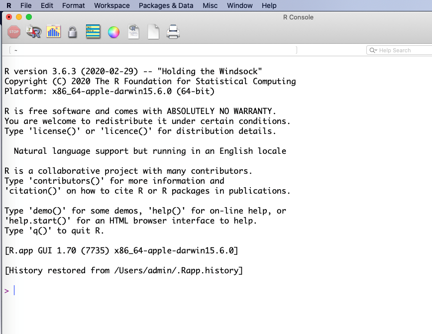

# Giới thiệu ngôn ngữ R

## R là gì?

Nói một cách ngắn gọn, $R$ là một phần mềm sử dụng cho phân tích thống kê và đồ thị. Thật ra, về bản chất,  $R$ là ngôn ngữ máy tính đa năng, có thể sử dụng cho nhiều mục tiêu khác nhau, từ tính toán đơn giản, toán học giải trí (recreational mathematics), tính toán ma trận (matrix), đến các phân tích thống kê phức tạp. Vì là một ngôn ngữ, cho nên người ta có thể sử dụng $R$ để phát triển thành các phần mềm chuyên môn cho một vấn đề tính toán chuyên biệt. 

Hai người sáng tạo ra $R$ là hai nhà thống kê học tên là Ross Ihaka và Robert Gentleman. Kể từ khi $R$ ra đời, rất nhiều nhà nghiên cứu thống kê và toán học trên thế giới ủng hộ và tham gia vào việc phát triển $R$. Chủ trương của những người sáng tạo ra $R$ là theo định hướng mở rộng (Open Access). Cũng một phần vì chủ trương này mà $R$ hoàn toàn miễn phí. Bất cứ ai ở bất cứ nơi nào trên thế giới đều có thể truy nhập và tải toàn bộ mã nguồn của $R$ về máy tính của mình để sử dụng. Cho đến nay, chỉ qua chưa đầy 5 năm phát triển, nhưng có nhiều các nhà thống kê học, toán học, nghiên cứu trong mọi lĩnh vực đã chuyển sang sử dụng $R$ để phân tích dữ liệu khoa học. Trên toàn cầu, đã có một mạng lưới gần một triệu người sử dụng $R$, và con số này đang tăng theo cấp số nhân. Có thể nói trong vòng 10 năm nữa, chúng ta sẽ không cần đến các phần mềm thống kê đắt tiền như $SAS$, $SPSS$ hay $Stata$ (các phần mềm này giá có thể lên đến 100.000 USD một năm) để phân tích thống kê nữa, vì tất cả các phân tích đó có thể thực hiện trên $R$.

Vì thế, những ai làm nghiên cứu khoa học cần nên học cách sử dụng $R$ cho phân tích thống kê và đồ thị. Chương này sẽ hướng dẫn bạn đọc cách cài đặt và sử dụng $R$. 

## Tải R xuống và cài đặt vào máy tính

Để sử dụng $R$, việc đầu tiên là chúng ta phải cài đặt $R$ trong máy tính của mình. Để làm việc này, ta phải truy nhập vào mạng và vào website có tên là “Comprehensive $R$ Archive Network” $(CRAN)$ sau đây: 

<http://cran.R-project.org>

Tài liệu cần tải về, tùy theo phiên bản, nhưng thường có tên bắt đầu bằng mẫu tự $R$ và số phiên bản (version). Chẳng hạn như phiên bản mà tác giả sử dụng vào cuối năm 2005 là 2.2.1, nên tên của tài liệu cần tải là:

$$R-2.2.1-win32.zip$$

Tài liệu này khoảng 26 MB, và địa chỉ cụ thể để tải là: 

<https://cran.r-project.org/bin/windows/base/R-3.6.3-win.exe>

Tại website này, chúng ta có thể tìm thấy rất nhiều tài liệu chỉ dẫn cách sử dụng $R$, đủ trình độ, từ sơ đẳng đến cao cấp. Nếu chưa quen với tiếng Anh, tài liệu này có thể cung cấp những thông tin cần thiết để sử dụng mà không cần phải đọc các tài liệu khác. 

Khi đã tải $R$ xuống máy tính, bước kế tiếp là cài đặt (set-up) vào máy tính. Để làm việc này, chúng ta chỉ đơn giản nhấn chuột vào tài liệu trên và làm theo hướng dẫn cách cài đặt trên màn hình. 

## Khởi động và ngưng chạy R

Sau khi hoàn tất việc cài đặt, một icon sẽ xuất hiện trên desktop của máy tính. Đến đây thì chúng ta đã sẵn sàng sử dụng $R$. Có thể nhấp chuột vào icon này và chúng ta sẽ có một cửa sổ như sau:

{width="0.65625in"height="0.5076388888888889in"}

Khi khởi động $R$, một giao diện cơ bản sẽ xuất hiện như sau (trên máy Apple Macbook): 



$R$ thường được sử dụng dưới dạng *"command line"*, có nghĩa là chúng ta phải trực tiếp gõ lệnh vào cái prompt màu đỏ trên. Các lệnh phải tuân thủ nghiêm ngặt theo *“văn phạm”* và ngôn ngữ của $R$. Chẳng hạn như chúng ta muốn tìm hiểu xem trong $R$ có những dữ liệu đã được cài đặt cho thực hành phân tích, chúng ta có thể dùng hàm $data$ như sau:

```{r}
data()
```

một cửa sổ sẽ được mở ra với một danh sách dữ liệu trong $R$. Chẳng hạn như chúng ta muốn truy cập dữ liệu $ToothGrowth$ của một nghiên cứu về sự ảnh hưởng của 3 liều lượng vitamin C đến sự tăng trưởng của răng heo. Chúng ta có thể dùng hàm:

```{r}
data(ToothGrowth)
```

```{r}
dim(ToothGrowth)
```

```{r}
head(ToothGrowth)
```

Hàm thứ hai, dim, có nghĩa là báo cho biết số dòng (60) và số cột (3) của dữ liệu $ToothGrowth$. Hàm kế tiếp $head$, liệt kê 6 dòng đầu tiên của dữ liệu. Chúng ta thấy dữ liệu này có 3 cột hay biến số:

- biến số đầu tiên là độ dài của răng (cm); 
- biến thứ hai là hai cách cho heo dùng vitamin C: cách thứ nhất là cho ăn cam, tiết tắt là OJ, và cách thứ hai là qua ascobic acid, viết tắt VC; và 
- biến thứ ba là nồng độ gồm các giá trị 0.5, 1.0, và 2 mg.   

Để 'khai thác' dữ liệu, chúng ta cần phải biết một số hàm căn bản cho phân tích và sẽ được giải thích trong sách này. Chẳng hạn như chúng ta muốn biết những chỉ số cơ bản về dữ liệu, chỉ cần với hàm summary có thể cung cấp các chỉ số như tối thiểu, tối đa, trung vị, bách phân vị, hoặc đối với biến phân nhóm thì số đếm: 

```{r}
summary(ToothGrowth)
```

Để so sánh độ dài của răng theo liều lượng vitamin C, chỉ cần với hàm $boxplot$:

```{r, fig.align='center'}
boxplot(ToothGrowth$len ~ ToothGrowth$dose)
```

hoặc thêm màu cho biểu đồ: 

```{r, fig.align='center'}
boxplot(ToothGrowth$len ~ ToothGrowth$dose, col=c("yellow", "green", "blue"))
```

Qua một số hàm / lệnh trên, chúng ta thấy một số đặc điểm chính của cú pháp $R$ như sau:

-   *mỗi hàm có đối số hay argument*: chẳng hạn như $dim(ToothGrowth)$,
    thì $dim$ là tên của hàm và $ToothGrowth$ là đối số;
-   *đối số phải có tên, và R phân biệt giữa chữ hoa và chữ thường*:
    Library và library khác nhau;
-   *biến số trong dữ liệu cần phải có dấu* \$: ví dụ như
    $ToothGrowth\$len$ có nghĩa là biến $len$ thuộc dữ liệu $ToothGrowth$;
    
Một văn phạm khác nữa là khi có hai chữ rời nhau, $R$ thường dùng dấu chấm để thay vào khoảng trống, chẳng hạn như $data.frame, t.test, read.table,v.v$…Điều này rất quan trọng, nếu không để ý sẽ làm mất thì giờ của người sử dụng.

Nếu lệnh gõ ra đúng *“văn phạm”* thì $R$ sẽ cho chúng ta một cái prompt khác hay cho ra kết quả nào đó (tùy theo lệnh); nếu lệnh không đúng văn phạm thì $R$ sẽ cho ra một thông báo ngắn là không đúng hay không hiểu.  Ví dụ, nếu chúng ta gõ:  

```{r}
x <- rnorm(20) 
```

thì $R$ sẽ hiểu và làm theo lệnh đó, rồi cho chúng ta một prompt khác:

\>

Nhưng nếu chúng ta gõ 

\> R is great

$R$ sẽ không "đồng ý" với lệnh này, vì ngôn ngữ này không có trong thư viện của $R$, một thông báo sau đây sẽ xuất hiện:

\> Error: unexpected symbol in "R is"

\>

Khi muốn rời khỏi $R$, chúng ta có thể đơn giản nhấn nút chéo (x) bên góc trái của cửa sổ, hay gõ lệnh $q()$.

## Packages

$R$ cung cấp cho chúng ta một "ngôn ngữ" máy tính và một số *function* để làm các phân tích căn bản và đơn giản. Nếu muốn thực hiện những phân tích phức tạp hơn, chúng ta cần phải tải về máy tính một số *package* khác. $Package$ là một phần mềm nhỏ được các nhà thống kê phát triển để giải quyết một vấn đề cụ thể, và có thể chạy trong hệ thống $R$. Chẳng hạn như để phân tích hồi qui tuyến tính, $R$ có function lm để sử dụng cho mục đích này, nhưng để làm các phân tích sâu hơn và phức tạp hơn, chúng ta cần đến các package như *lme4*. Các package này cần phải được tải về máy tính và cài đặt.

Địa chỉ để tải các package vẫn là: <http://cran.r-project.org>, rồi bấm vào phần "[Packages](http://cran.au.r-project.org/src/contrib/PACKAGES.html)" xuất hiện bên trái của mục lục trang web. Một số package cần tải về máy tính để sử dụng cho các ví dụ trong sách này là:

**Tên package**   **Chức năng**
----------------- --------------------------------------------------------------------------
readxl            Package dùng cho đọc dữ liệu từ excel
foreign           Dùng để nhập dữ liệu từ các phần mềm khác như SPSS, Stata, SAS, v.v...
dplyr             Dùng cho biên tập dữ liệu
tidyr             Dùng cho biên tập dữ liệu
magrittr          Dùng cho lập chương
Hmisc             Một số phương pháp mô hình dữ liệu của F. Harrell
rms               Package kèm theo cuốn sách về xây dựng mô hình tiên lượng của F. Harrell
survival          Phân tích sống còn
Rmeta, metafor    Dùng cho phân tích tổng hợp (meta-analysis)
BMA               Bayesian Model Average
psych             Package đa năng nhưng có nhiều chức năng cho phân tích tâm lí học.
Zelig             Package dùng cho các phân tích thống kê trong lĩnh vực xã hội học
Epi               Dùng cho các phân tích dịch tễ học
epitools          Một package khác chuyên cho các phân tích dịch tễ học
epiDisplay        Một package chuyên cho các phân tích dịch tễ học
genetics          Package dùng cho phân tích số liệu di truyền học
ggplot2           Package dùng cho biểu đồ chất lượng cao
explore           Phân tích mô tả
DescTools         Phân tích mô tả bằng bảng số liệu
table1            Phân tích mô tả bằng bảng số liệu đơn giản
compareGroups     Phân tích mô tả bằng bảng số liệu

Khi máy đã được nối mạng, chúng ta có thể cài đặt những package này bằng hàm $install.packages$. Ví dụ để cài đặt package $ggplot2$, chúng ta gõ:

$$install.packages("ggplot2", dependencies=T)$$

Trong hàm trên, chú ý tên của package phải để trong ngoặc kép. Đối số $dependencies=T$ yêu cầu $R$ cài đặt cả những package phụ thuộc vào $ggplot2$. Chúng ta cũng có thể cài đặt nhiều package trong một hàm:

$$install.packages(c("ggplot2", "table1", "DescTools", "compareGroups"))$$

## "Văn phạm" ngôn ngữ R

"Văn phạm" chung của $R$ là một lệnh (command) hay function (thỉnh thoảng đề cập đến là "hàm"). Mà đã là hàm thì phải có thông số; cho nên theo sau hàm là những thông số mà chúng ta phải cung cấp. Chẳng hạn như:

$$reg <- lm(y ~ x)$$ 

thì $reg$ là một object, còn $lm$ là một hàm, và $y ~ x$ là thông số hay đối số của hàm.  Hay:

$$setwd("c:/works/stats")$$
thì $setwd$ là một hàm, còn $c:/works/stats$ là thông số của hàm.  Chú ý $R$ dùng dấu 'straight quote' (như " ") chứ không phải dấu ngoặc vòng (“ ”).  

Để biết một hàm cần có những thông số nào, chúng ta dùng lệnh $args(x)$, ($args$ viết tắt chữ $arguments$) mà trong đó x là một hàm chúng ta cần biết: 

```{r}
args(lm)
```

$R$ là một ngôn ngữ “đối tượng” (object oriented language).  Điều này có nghĩa là các dữ liệu trong $R$ được chứa trong object.  Định hướng này cũng có vài ảnh hưởng đến cách viết của $R$.  Chẳng hạn như thay vì viết $x = 5$ như thông thường chúng ta vẫn viết, thì $R$ yêu cầu viết là $x == 5$.

Đối với $R$, $x = 5$ tương đương với $x <- 5$.  Cách viết sau (dùng kí hiệu $<-$) được khuyến khích hơn là cách viết trước ($=$).  Chẳng hạn như:

```{r}
x <- rnorm(10) 
```

có nghĩa là mô phỏng 10 số liệu và chứa trong object x.  Chúng ta cũng có thể viết $x = rnorm(10)$.

Một số kí hiệu hay dùng trong $R$ là:

**Kí hiệu:**      **Mô tả:**
----------------- --------------------------------------------------------------
x == 5	          x bằng 5
x != 5	          x không bằng 5
y < x	y           nhỏ hơn x
x > y	x           lớn hơn y
z <= 7	          z nhỏ hơn hoặc bằng 7
p >= 1	          p lớn hơn hoặc bằng 1
is.na(x)	        Có phải x là biến số missing 
A & B	            A và B (AND)
A | B	            A hoặc B (OR)
!	                Không là (NOT)

Chúng ta sẽ làm quen với cách sử dụng các kí hiệu vận hành này trong chương sau. 

Với $R$, tất cả các câu chữ hay lệnh sau kí hiệu # đều không có hiệu ứng, vì # là kí hiệu dành cho người sử dụng thêm vào các ghi chú, ví dụ: 

```{r}
# lệnh sau đây sẽ mô phỏng 10 giá trị normal
x <- rnorm(10) 
```

## Cách đặt tên đối tượng

Đặt tên một đối tượng (object) hay một biến số (variable) trong $R$ khá linh hoạt, vì $R$ không có nhiều giới hạn như các phần mềm khác. Tên một object phải được viết liền nhau (tức không được cách rồi bằng một khoảng trống). Chẳng hạn như $R$ chấp nhận $myobject$ nhưng không chấp nhận $my object$.

\> myobject <- rnorm(10)

\> my object <- rnorm(10)

\> Error: syntax error in "my object"


Nhưng đôi khi tên myobject khó đọc, cho nên chúng ta nên tách rời bằng “.” như $my.object$.  

```{r}
my.object <- rnorm(10)
```

Một điều quan trọng cần lưu ý là $R$ phân biệt mẫu tự viết hoa và viết thường.  Cho nên $My.object$ khác với $my.object$.  Ví dụ: 

```{r}
My.object.u <- 15
```

```{r}
my.object.L <- 5
```

```{r}
My.object.u + my.object.L
```

Một vài điều cần lưu ý khi đặt tên trong $R$ là: 

- Không nên đặt tên một biến số hay variable bằng kí hiệu $“\_”$ (underscore) như $my\_object$ hay $my-object$. 
- Không nên đặt tên một object giống như một biến số trong một dữ liệu.  Ví dụ, nếu chúng ta có một $data.frame$ (dữ liệu hay dataset) với biến số $age$ trong đó, thì không nên có một object trùng tên $age$, tức là không nên viết: $age$ $<-$ $age$.  Tuy nhiên, nếu data.frame tên là $data$ thì chúng ta có thể đề cập đến biến số $age$ với một kí tự \$ như sau: $data\$age$. (Tức là biến số $age$ trong data.frame $data$), và trong trường hợp đó, $age$ $<-$ $data\$age$ có thể chấp nhận được.

## Hỗ trợ trong R

Ngoài lệnh $args()$ $R$ còn cung cấp lệnh $help()$ để người sử dụng có thể hiểu “văn phạm” của từng hàm. Chẳng hạn như muốn biết hàm $lm$ có những thông số (arguments) nào, chúng ta chỉ đơn giản lệnh: 

\> help(lm)

hay

\> ?lm

Một cửa sổ sẽ hiện ra bên phải của màn hình chỉ rõ cách sử dụng ra sao và thậm chí có cả ví dụ. Bạn đọc có thể đơn giản copy và dán ví dụ vào $R$ để xem cách vận hành. 

Trước khi sử dụng $R$, ngoài sách này nếu cần bạn đọc có thể đọc qua phần chỉ dẫn có sẵn trong $R$ bằng cách chọn mục help và sau đó chọn Html help như hình dưới đây để biết thêm chi tiết. Bạn đọc cũng có thể copy và dán các lệnh trong mục này vào $R$ để xem cho biết cách vận hành của $R$. 

Thay vì chọn mục trên, bạn đọc cũng có thể đơn giản lệnh:

\> help.start()

và một cửa sổ sẽ xuất hiện chỉ dẫn toàn bộ hệ thống $R$. 

Hàm $apropos$ cũng rất có ích vì nó cung cấp cho chúng ta tất cả các hàm trong $R$ bắt đầu bằng kí tự mà chúng ta muốn tìm.  Chẳng hạn như chúng ta muốn biết hàm nào trong $R$ có kí tự “lm” thì chỉ đơn giản lệnh: 

\> apropos(lm)

Và $R$ sẽ báo cáo các hàm với kí tự lm như sau có sẵn trong $R$. 

## Môi trường vận hành

Dữ liệu phải được chứa trong một khu vực (directory) của máy tính.  Trước khi sử dụng $R$, có lẽ cách hay nhất là tạo ra một directory để chứa dữ liệu, chẳng hạn như c:\\works\\stats. Để $R$ biết dữ liệu nằm ở đâu, chúng ta sử dụng lệnh $setwd$ (set working directory) như sau:

\> setwd("c:/works/stats") 

Lệnh trên báo cho $R$ biết là dữ liệu sẽ chứa trong directory có tên là c:\\works\\stats. Chú ý rằng, $R$ dùng forward slash “/” chứ không phải backward slash “\\” như trong hệ thống Windows. 

Chú ý rằng $R$ có khả năng đọc dữ liệu trực tiếp từ mạng (từ các website). Do đó, chúng ta cũng có thể dùng lệnh setwd để báo cho $R$ biết rằng chúng ta làm việc trực tiếp trên mạng như trong lệnh sau đây: 

\> setwd("http://www.r.ykhoanet.com/")

Để biết hiện nay, $R$ đang “làm việc” ở directory nào, chúng ta chỉ cần lệnh: 

\> getwd()

\> [1] "C:/Program Files/R/R-2.2.1"

Cái prompt mặc định của $R$ là $“>”$. Nhưng nếu chúng ta muốn có một prompt khác theo cá tính cá nhân, chúng ta có thể thay thế : 

```{r}
options(prompt="R> ")
```

R>

Hay:

```{r}
options(prompt="Tuan> ")
```

Tuan> 

Màn ảnh $R$ mặc định là 80 kí tự (characters), nhưng nếu chúng ta muốn màn ảnh rộng hơn, thì chỉ cần đưa ra lựa chọn như: 

```{r}
options(width=100)
```

Hay muốn $R$ trình bày các số liệu ở dạng 3 số thập phân: 

```{r}
options(scipen=3)
```

Các lựa chọn và thay đổi này có thể dùng lệnh $options()$. Để biết các thông số hiện tại của $R$ là gì, chúng ta chỉ cần lệnh: 

```{r, results='hide'}
options()
```

Tìm hiểu ngày tháng: 

```{r}
Sys.Date()
```

***

Trong chương này, các bạn đã làm quen với môi trường vận hành của $R$. Như có thể thấy, đó là một môi trường tương tác, hiểu theo nghĩa bạn gõ một lệnh và $R$ báo cáo kết quả của lệnh đó. Nếu lệnh sai cú pháp thì $R$ cũng sẽ báo cáo có lỗi. Môi trường tương tác rất tốt để chúng ta vừa học vừa thực hành, và dễ cảm nhận được ý nghĩa của việc học. 

Tuy nhiên, kinh nghiệm thực tế cho thấy lần đầu tiên sử dụng $R$ sẽ làm cho các bạn lúng túng vì có thể gõ lệnh sai, hay tên biến số không đúng, hay không nhớ biến số, v.v. Do đó, thay vì làm việc một cách tương tác, các bạn có thể làm việc trong môi trường 'thân thiện' hơn qua hệ thống $RStudio$ (<https://rstudio.com/>) và công cụ $RMarkdown$ (trong $RStudio$). $RStudio$ có thể xem là một phần mềm được xây dựng trên nền tảng $R$ nhưng có các 'menu' và công cụ chuyên dụng giúp cho người sử dụng $R$ có thể lưu trữ các mã phân tích, đảm bảo tính tái lập của kết quả phân tích. $RStudio$ và $RMarkdown$ là hai công cụ quan trọng và sẽ được giới thiệu trong một chương 25. 

**Chú thích:** 

Nếu cần thêm chi tiết, bạn đọc có thể tham khảo một số sách giới thiệu ngôn ngữ R dễ đọc (theo ý kiến của tôi) như sau: 

1.  Peter Dalgaard: *Introductory Statistics with R*. Springer 2008. 
2.  Michael Crawley: *Statistics – an introduction using R*. Wiley 2005 
3.  Daniela Witten, Gareth James, Robert Tibshirani, Trevor Hastie: *An Introduction to Statistical Learning: With Applications in R*. Springer 2017. 
4.  Frank Harrell: *Regression Modelling Strategies*. Springer 2015. 


