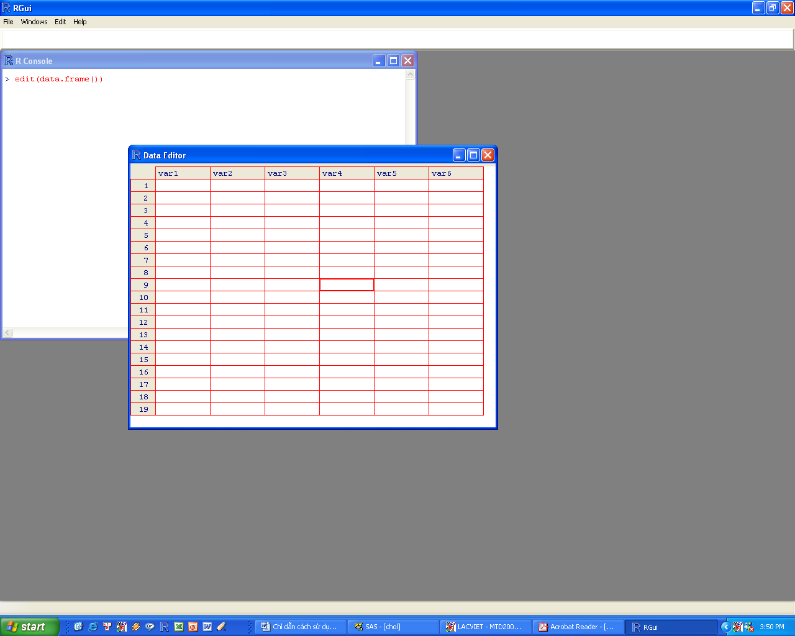
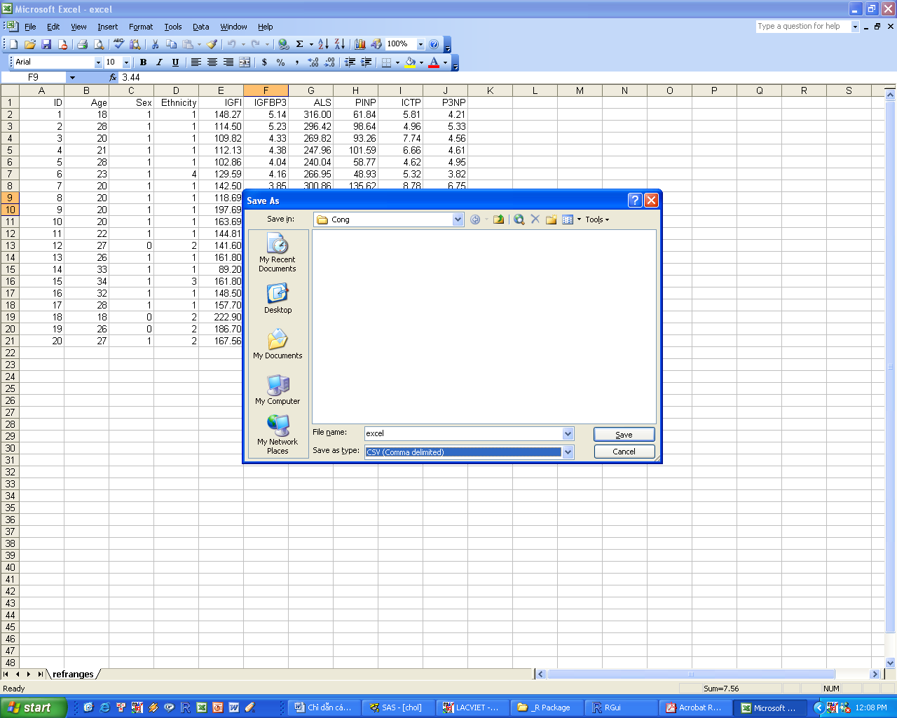

# Nhập dữ liệu {#Nhap-du-lieu}

Muốn làm phân tích dữ liệu bằng $R$, chúng ta phải có sẵn dữ liệu ở dạng mà $R$ có thể hiểu được để xử lí. Dữ liệu mà $R$ hiểu được phải là dữ liệu trong một `data.frame`. Có nhiều cách để nhập số liệu vào một `data.frame` trong $R$, từ nhập trực tiếp đến nhập từ các nguồn khác nhau. Sau đây là một số cách thông dụng nhất:

- Nhập dữ liệu trực tiếp
- Nhập dữ liệu trong frame
- Đọc dữ liệu từ các phần mềm khác như Excel

## Nhập số liệu trực tiếp: c()

**Ví dụ 1:** chúng ta có số liệu về độ tuổi và insulin cho 10 bệnh nhân như sau, và muốn nhập vào $R$.

*Tuổi* *Insulin*
------ ---------
50     16.5
62     10.8
60     32.3
40     19.3
48     14.2
47     11.3
57     15.5
70     15.8
48     16.2
67     11.2

Chúng ta có thể sử dụng function có tên `c` như sau:

```{r}
age = c(50,62, 60,40,48,47,57,70,48,67)
insulin = c(16.5,10.8,32.3,19.3,14.2,11.3,15.5, 15.8,16.2,11.2)
```

Lệnh thứ nhất cho $R$ biết rằng chúng ta muốn tạo ra một cột dữ liệu (sẽ gọi là *biến số*, tức *variable*) có tên là `age`, và lệnh thứ hai là tạo ra một cột khác có tên là `insulin`. Tất nhiên, chúng ta có thể lấy một tên khác mà mình thích.

Chúng ta dùng function `c` (viết tắt của chữ $concatenation$ -- có nghĩa là "móc nối vào nhau") để nhập dữ liệu. Chú ý rằng mỗi số liệu cho mỗi bệnh nhân được cách nhau bằng một dấu phẩy.

Kí hiệu `insulin <-` (cũng có thể viết là `insulin =`) có nghĩa là các số liệu theo sau sẽ có nằm trong biến số `insulin`. Chúng ta sẽ gặp kí hiệu này rất nhiều lần trong khi sử dụng $R$.

$R$ là một ngôn ngữ cấu trúc theo dạng đối tượng (thuật ngữ chuyên môn là "object-oriented language"), vì mỗi cột số liệu hay mỗi một `data.frame` là một đối tượng (object) đối với $R$. Vì thế, `age` và `insulin` là hai đối tượng riêng lẻ. Bây giờ chúng ta cần phải nhập hai đối tượng này thành một `data.frame` để $R$ có thể xử lí sau này. Để làm việc này chúng ta cần đến function `data.frame`:

```{r}
df = data.frame(age, insulin)
```

Trong lệnh này, chúng ta muốn cho $R$ biết rằng nhập hai cột (hay hai đối tượng) `age` và `insulin` vào một đối tượng có tên là `df`.

Đến đây thì chúng ta đã có một đối tượng hoàn chỉnh để tiến hành phân tích thống kê. Để kiểm tra xem trong tuan có gì, chúng ta chỉ cần đơn giản gõ:

```{r, eval=FALSE}
df
```

Và R sẽ báo cáo:

```{r, echo=FALSE}
df
```

Nếu chúng ta muốn lưu lại các số liệu này trong một file theo dạng $R$, chúng ta cần dùng lệnh save. Giả dụ như chúng ta muốn lưu số liệu trong directory có tên là `C:\\works\\stats`, chúng ta cần gõ như sau:

```{r, echo=FALSE, eval=FALSE, warning=FALSE}
setwd("C:/")
dir.create("C:/works")
setwd("C:/works")
dir.create("C:/works/stats")
```

```{r}
setwd("C:/works/stats")
save(df, file="df.rda")
```

Lệnh đầu tiên (`setwd` -- chữ `wd` có nghĩa là working directory) cho $R$ biết rằng chúng ta muốn lưu các số liệu trong directory có tên là `C:\\works\\stats`. Lưu ý rằng thông thường hệ thống Windows dùng dấu backward slash "`\\`", nhưng trong R chúng ta dùng dấu forward slash "`/`".

Lệnh thứ hai (`save`) cho R biết rằng các số liệu trong đối tượng tuan sẽ lưu trong file có tên là "`df.rda`". Sau khi gõ xong hai lệnh trên, một file có tên tuan.rda sẽ có mặt trong directory đó.

## Nhập số liệu trực tiếp: edit(data.frame())

**Ví dụ 1 (tiếp tục):** chúng ta có thể nhập số liệu về độ tuổi và insulin cho 10 bệnh nhân bằng một function rất có ích, đó là: `edit(data.frame())`. Với function này, $R$ sẽ cung cấp cho chúng ta một cửa sổ mới với một dãy cột và dòng giống như Excel, và chúng ta có thể nhập số liệu trong bảng đó. Ví dụ:

```{r, eval=FALSE}
ins = edit(data.frame())
```
Chúng ta sẽ có một window như sau:



Ở đây, $R$ không biết chúng ta có biến số nào, cho nên $R$ liệt kê các biến số $var1, var2, v.v...$ Nhấp chuột vào cột $var1$ và thay đổi bằng cách gõ vào đó $age$. Nhấp chuột vào cột $var2$ và thay đổi bằng cách gõ vào đó $insulin$. Sau đó gõ số liệu cho từng cột. Sau khi xong, bấm nút chéo X ở góc phải của spreadsheet, chúng ta sẽ có một $data.frame$ tên $ins$ với hai biến số $age$ và $insulin$.

## Nhập số liệu từ một *text file:* read.table

**Ví dụ 2**: Chúng ta thu thập số liệu về độ tuổi và $cholesterol$ từ một nghiên cứu ở 50 bệnh nhân mắc bệnh cao huyết áp. Các số liệu này được lưu trong một text file có tên là `chol.txt` tại directory `C:\\works\\stats`. Số liệu này như sau: cột 1 là mã số của bệnh nhân ($id$), cột 2 là giới tính ($sex$), cột 3 là body mass index ($bmi$), cột 4 là HDL cholesterol (viết tắt là $hdl$), kế đến là LDL cholesterol ($ldl$), total cholesterol ($tc$) và triglycerides ($tg$).

id   sex  age  bmi  hdl   ldl  tc   tg
---- ---- ---- ---- ----- ---- ---- ----
1    Nam  57   17   5.000 2.0  4.0  1.1
2    Nu   64   18   4.380 3.0  3.5  2.1
3    Nu   60   18   3.360 3.0  4.7  0.8
4    Nam  65   18   5.920 4.0  7.7  1.1
5    Nam  47   18   6.250 2.1  5.0  2.1
6    Nu   65   18   4.150 3.0  4.2  1.5
7    Nam  76   19   0.737 3.0  5.9  2.6
8    Nam  61   19   7.170 3.0  6.1  1.5
9    Nam  59   19   6.942 3.0  5.9  5.4
10   Nu   57   19   5.000 2.0  4.0  1.9
...
44   Nam  45   24   5.450 2.8  6.0  2.6
45   Nam  63   24   5.000 3.0  4.0  1.8
46   Nu   52   24   3.360 2.0  3.7  1.2
47   Nam  64   24   7.170 1.0  6.1  1.9
48   Nam  45   24   7.880 4.0  6.7  3.3
49   Nu   64   25   7.360 4.6  8.1  4.0
50   Nu   62   25   7.750 4.0  6.2  2.5

Chúng ta muốn nhập các dữ liệu này vào $R$ để tiện việc phân tích sau này. Chúng ta sẽ sử dụng lệnh $read.table$ như sau:

```{r}
setwd("c:/works/stats")
chol = read.table("chol.txt", header=TRUE)
```

Lệnh thứ nhất chúng ta muốn đảm bảo $R$ truy nhập đúng directory mà số liệu đang được lưu giữ. Lệnh thứ hai yêu cầu $R$ nhập số liệu từ file có tên là "`chol.txt`" (trong directory `C:\\works\\stats`) và cho vào đối tượng `chol`. Trong lệnh này, `header=TRUE` có nghĩa là yêu cầu $R$ đọc dòng đầu tiên trong file đó như là tên của từng cột dữ kiện.

Chúng ta có thể kiểm tra xem $R$ đã đọc hết các dữ liệu hay chưa bằng cách ra lệnh:

```{r, eval=FALSE}
chol
```

hay

```{r, eval=FALSE}
names(chol)
```

$R$ sẽ cho biết có các cột như sau trong dữ liệu (`name` là lệnh hỏi trong dữ liệu có những cột nào và tên gì):

```{r, echo=FALSE}
names(chol)
```

Bây giờ chúng ta có thể lưu dữ liệu dưới dạng $R$ để xử lí sau này bằng cách ra lệnh:

```{r, eval=FALSE}
save(chol, file="chol.rda")
```
  
## Nhập số liệu từ *Excel:* read.csv

Để nhập số liệu từ phần mềm Excel, chúng ta cần tiến hành 2 bước:

- Bước 1: Dùng lệnh "Save as" trong Excel và lưu số liệu dưới dạng "csv";
- Bước 2: Dùng R (lệnh `read.csv`) để nhập dữ liệu dạng csv.

**Ví dụ 3**: Một dữ liệu gồm các cột sau đây đang được lưu trong Excel, và chúng ta muốn chuyển vào R để phân tích. Dữ liệu này có tên là `excel.xls`.

  ---- ----- ----- ----------- -------- -------- -------- -------- ------ ------
  ID   Age   Sex   Ethnicity   IGFI     IGFBP3   ALS      PINP     ICTP   P3NP
  1    18    1     1           148.27   5.14     316.00   61.84    5.81   4.21
  2    28    1     1           114.50   5.23     296.42   98.64    4.96   5.33
  3    20    1     1           109.82   4.33     269.82   93.26    7.74   4.56
  4    21    1     1           112.13   4.38     247.96   101.59   6.66   4.61
  5    28    1     1           102.86   4.04     240.04   58.77    4.62   4.95
  6    23    1     4           129.59   4.16     266.95   48.93    5.32   3.82
  7    20    1     1           142.50   3.85     300.86   135.62   8.78   6.75
  8    20    1     1           118.69   3.44     277.46   79.51    7.19   5.11
  9    20    1     1           197.69   4.12     335.23   57.25    6.21   4.44
  10   20    1     1           163.69   3.96     306.83   74.03    4.95   4.84
  11   22    1     1           144.81   3.63     295.46   68.26    4.54   3.70
  12   27    0     2           141.60   3.48     231.20   56.78    4.47   4.07
  13   26    1     1           161.80   4.10     244.80   75.75    6.27   5.26
  14   33    1     1           89.20    2.82     177.20   48.57    3.58   3.68
  15   34    1     3           161.80   3.80     243.60   50.68    3.52   3.35
  16   32    1     1           148.50   3.72     234.80   83.98    4.85   3.80
  17   28    1     1           157.70   3.98     224.80   60.42    4.89   4.09
  18   18    0     2           222.90   3.98     281.40   74.17    6.43   5.84
  19   26    0     2           186.70   4.64     340.80   38.05    5.12   5.77
  20   27    1     2           167.56   3.56     321.12   30.18    4.78   6.12
  ---- ----- ----- ----------- -------- -------- -------- -------- ------ ------

Việc đầu tiên là chúng ta cần làm, như nói trên, là vào Excel để lưu dữ liệu dưới dạng csv:

- Vào Excel, chọn $File -> Save$ $as$
- Chọn $Save$ $as$ $type$ $"$$CSV (Comma$ $delimited)"$



Sau khi xong, chúng ta sẽ có một file với tên $"excel.csv"$ trong directory "`C:\\works\\stats`".

Việc thứ hai là vào R và ra những lệnh sau đây:

```{r}
setwd("C:/works/stats")
gh = read.csv ("excel.csv", header=TRUE)
```

Lệnh thứ hai read.csv yêu cầu R đọc số liệu từ $"excel.csv"$, dùng dòng thứ nhất là tên cột, và lưu các số liệu này trong một object có tên là gh.

Bây giờ chúng ta có thể lưu gh dưới dạng R để xử lí sau này bằng lệnh sau đây:

```{r}
save(gh, file="gh.rda")
```

## Nhập số liệu từ một *SPSS:* read.spss

Phần mềm thống kê $SPSS$ lưu dữ liệu dưới dạng “$sav$”.  Chẳng hạn như nếu chúng ta đã có một dữ liệu có tên là $testo.sav$ trong directory `C:\works\stats` và muốn chuyển dữ liệu này sang dạng $R$ có thể hiểu được, chúng ta cần sử dụng lệnh `read.spss` trong package có tên là `foreign`.  Các lệnh sau đây sẽ hoàn tất dễ dàng việc này:

Việc đầu tiên chúng ta cho truy nhập foreign  bằng lệnh `library`:

```{r}
library(foreign)
```

Việc thứ hai là lệnh `read.spss`:

```{r, error=TRUE, eval=FALSE}
setwd("C:/works/stats") 
testo = read.spss(“testo.sav”, to.data.frame=TRUE)
```

Lệnh thứ hai `read.spss` yêu cầu $R$ đọc số liệu từ “$testo.sav$”, và cho vào một $data.frame$ có tên là $testo$.   

Bây giờ chúng ta có thể lưu $testo$ dưới dạng $R$ để xử lí sau này bằng lệnh sau đây: 

```{r, error=TRUE, eval=FALSE}
save(testo, file="testo.rda")
```

## Thông tin cơ bản về dữ liệu

Giả dụ như chúng ta đã nhập số liệu vào một data.frame có tên là `chol` như trong ví dụ 1. Để tìm hiểu xem trong dữ liệu này có gì, chúng ta có thể nhập vào $R$ như sau:

-   Dẫn cho R biết chúng ta muốn xử lí `chol` bằng cách dùng lệnh `attach(arg)` với `arg` là tên của dữ liệu..

```{r, results=FALSE}
attach(chol)
```

-   Chúng ta có thể kiểm tra xem chol có phải là một data.frame không bằng lệnh `is.data.frame(arg)` với `arg` là tên của dữ liệu. Ví dụ:

```{r}
is.data.frame(chol)
```

$R$ cho biết `chol` quả là một data.frame.

-   Có bao nhiêu cột (hay *variable = biến số*) và dòng số liệu (observations) trong dữ liệu này? Chúng ta dùng lệnh `dim(arg)` với arg là tên của dữ liệu. (`dim` viết tắt chữ dimension). Ví dụ (kết quả của $R$ trình bày ngay sau khi chúng ta gõ lệnh):

```{r}
dim(chol)
```

-   Như vậy, chúng ta có 50 dòng và 8 cột (hay biến số). Vậy những biến số này tên gì? Chúng ta dùng lệnh names(arg) với arg là tên của dữ liệu. Ví dụ:

```{r}
names(chol)
```

-   Trong biến số sex, chúng ta có bao nhiêu nam và nữ? Để trả lời câu hỏi này, chúng ta có thể dùng lệnh table(arg) với arg là tên của biến số. Ví dụ:

```{r}
table(sex)
```

Kết quả cho thấy dữ liệu này có 1 “nam”, 21 “Nam” và 28 “Nu”. Chú ý $R$ phân biệt giữa “nam” và “Nam” nên xem đây là hai nhóm khác nhau!

Trên đây là vài cách nhập dữ liệu vào $R$.Trong thực tế, $R$ có thể đọc dữ liệu từ rất nhiều phần mềm thông dụng, kể cả các phần mềm thống kê như $SPSS$ (mà chúng ta đã xem qua)$, SAS, STATA, v.v…$ Nhưng để đọc dữ liệu từ các phần mềm này, bạn đọc cần phải tải package `foreign` về máy và cài đặt vào $R$.  Package `foreign` có thể tải từ website chính thức của $R$. 

## Cách tìm dữ liệu qua file.choose()

Một trong những khó khăn trong việc đọc dữ liệu vào $R$ là tìm file cần thiết. Trong môi trường hệ điều hành và đĩa cứng có quá nhiều folders và những "nhánh" folder, việc tìm file có khi khá nan giải. Chẳng hạn như nếu file có tên là "birthwt.csv" được lưu trữ trong (hệ điều hành MacOS)  "`~/Dropbox/Books/Q&A Book/Datasets/Data for book`", thì hàm R phải viết đầy đủ là:

```{r, error=TRUE, eval=FALSE}
read.csv("~/Dropbox/Books/Q&A Book/Datasets/Data for book/birthwt.csv")
```

Rất khó để nhớ tên folder và nhánh folder như trên! Do đó, trong $R$ có hàm file.choose rất có ích cho việc tìm file cần thiết. Cách dùng hàm này rất đơn giản như sau:

Bước 1, xác định đường dẫn:

```{r, error=TRUE, eval=FALSE}
t = file.choose()
```

Sau hàm này, máy sẽ mở một cửa sổ để chúng ta có thể tìm file liên quan. Sau khi tìm được file liên quan, chúng ta chỉ cần "Open", và đối tượng t sẽ là một đường dẫn. Chẳng hạn như t trong ví dụ trên là:

"`~/Dropbox/Books/Q&A Book/Datasets/Data for book/birthwt.csv`"

Bước 2, dùng `read.csv` đọc file:

```{r, error=TRUE, eval=FALSE}
dat = read.csv(t)
```

Nhập dữ liệu và đọc dữ liệu là bước rất quan trọng trong phân tích dữ liệu. Một trong những khó khăn là khi dữ liệu được lưu trữ qua một phần mềm khác (chẳng hạn như $Excel$, $Stata$, hay $SPSS$), tuy $R$ vẫn có thể đọc dễ dàng, nhưng vì cách sắp xếp và tổ chức dữ liệu khác nhau, nên kết quả của nhập dữ liệu có thể không như ý muốn. Có thể các biến số bị đổi từ dạng numeric sang dạng character, và nếu không kiểm tra cẩn thận sẽ dẫn đến sai sót trong phân tích. Do đó, bạn đọc cần phải đầu tư nhiều thời gian cho việc kiểm tra sự toàn vẹn của dữ liệu trước khi thực hành bất cứ một phân tích nào. 
