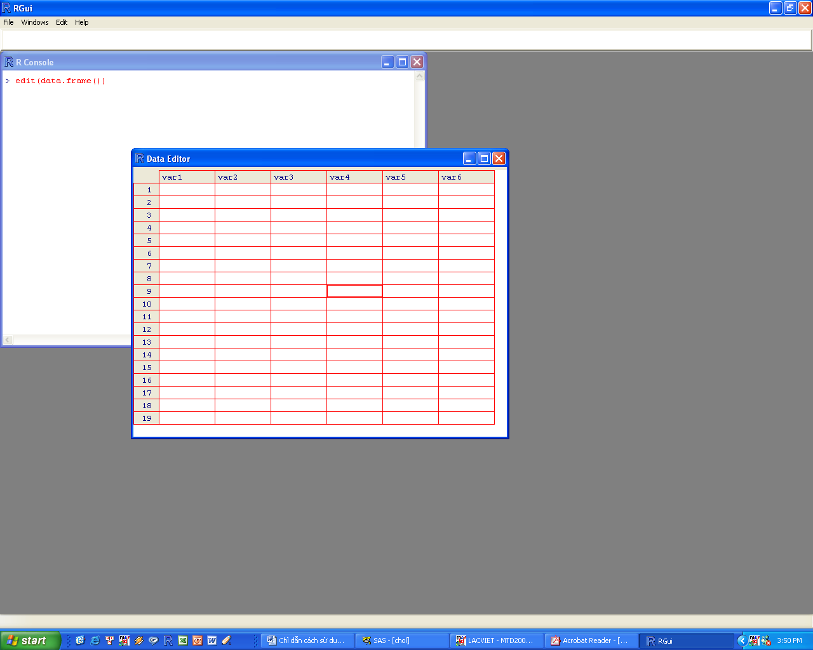
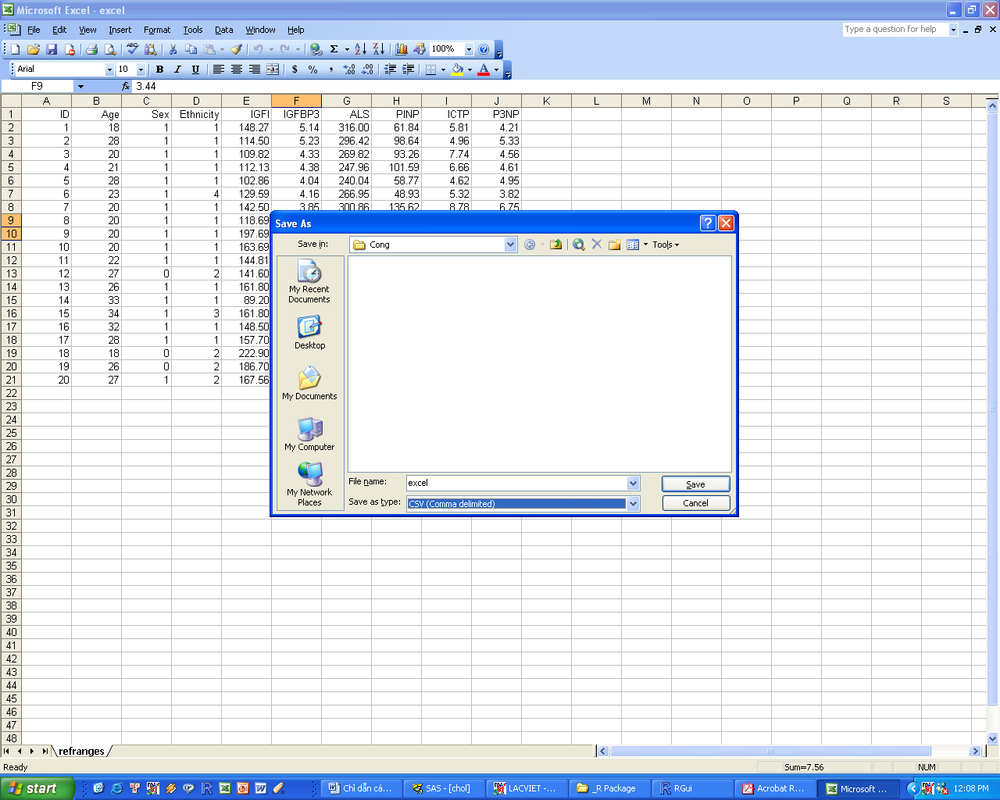

--- 
title: "Phân tích DỮ LIỆU với R"
author: "Nguyễn Văn Tuấn"
date: "`r Sys.Date()`"
knit: bookdown::render_book
site: bookdown::bookdown_site
monofont: "Source Code Pro"
monofontoptions: "Scale=1.2"
documentclass: book
bibliography: [book.bib, packages.bib]
biblio-style: apalike
description: "On going"
cover-image: "_book_media/Figures/Cover.jpg"
colorlinks: yes
graphics: yes
---

# Lời nói đầu {-}

<a></a>

Thống kê là một bộ môn khoa học về dữ liệu. Dữ liệu có thể được thu thập từ những nghiên cứu khoa học, nhưng cũng có thể bắt nguồn từ những “thí nghiệm tự nhiên” trong xã hội và đời sống hàng ngày. Khoa học thống kê (statistical science) và những phương pháp thống kê giúp chúng ta chuyển hoá dữ liệu thô thành thông tin, và với kiến thức chuyên ngành, biến thông tin thành tri thức. Do đó, khoa học thống kê đóng một vai trò không thể thiếu được trong việc hoán chuyển dữ liệu thành thông tin và tri thức. 

Trái với quan điểm của nhiều người xem thống kê là một công cụ, trong thực tế các phương pháp phân tích dù dựa vào nền tảng của toán học và xác suất, nhưng đó chỉ là phần “kĩ thuật”, phần quan trọng hơn là thiết kế nghiên cứu và diễn giải ý nghĩa dữ liệu. Người làm thống kê, do đó, không chỉ là người đơn thuần làm phân tích dữ liệu, mà phải là một nhà khoa học, một nhà suy nghĩ (thinker) về nghiên cứu khoa học. Chính vì thế, mà khoa học thống kê đóng một vai trò cực kì quan trọng, một vai trò không thể thiếu được trong các công trình nghiên cứu khoa học, nhất là khoa học thực nghiệm. Có thể nói rằng ngày nay, nếu không có thống kê thì các thử nghiệm gen với triệu triệu số liệu chỉ là những con số vô hồn, vô nghĩa. 

Một công trình nghiên cứu khoa học, cho dù có tốn kém và quan trọng cỡ nào, nếu không được phân tích đúng phương pháp sẽ không có ý nghĩa khoa học gì cả. Chính vì thế mà ngày nay, chỉ cần nhìn qua tất cả các tập san nghiên cứu khoa học trên thế giới, hầu như bất cứ bài báo y học nào cũng có phần “Statistical Analysis” (Phân tích thống kê), nơi mà tác giả phải mô tả cẩn thận phương pháp phân tích, tính toán như thế nào, và giải thích ngắn gọn tại sao sử dụng những phương pháp đó để hàm ý “bảo kê” hay tăng trọng lượng khoa học cho những phát biểu trong bài báo. Các tạp san y học có uy tín càng cao yêu cầu về phân tích thống kê càng nặng. 

Một trong những phát triển quan trọng nhất trong khoa học thống kê là ứng dụng máy tính cho phân tích và tính toán thống kê. Có thể nói không ngoa rằng không có máy tính, khoa học thống kê vẫn chỉ là một khoa học buồn tẻ khô khan, với những công thức rắc rối mà thiếu tính ứng dụng vào thực tế. Máy tính đã giúp khoa học thống kê làm một cuộc cách mạng lớn nhất trong lịch sử của bộ môn: đó là đưa khoa học thống kê vào thực tế, giải quyết các vấn đề gai góc nhất và góp phần làm phát triển khoa học thực nghiệm. Ngày nay, với một máy tính cá nhân, bất cứ ai cũng có thể thực hiện những phân tích thống kê phức tạp trong vòng vài giây mà trước đây phải tốn hàng tháng trời mới hoàn tất. 

Nhưng nếu máy tính mà không có phần mềm thì máy tính cũng chỉ là một đống sắt hay silicon “vô hồn” và vô dụng. Một phần mềm đã, đang và sẽ làm cách mạng thống kê là R. Phần mềm này được một số nhà nghiên cứu thống kê và khoa học trên thế giới phát triển và hoàn thiện trong khoảng 20 năm qua để sử dụng cho việc học tập, giảng dạy và nghiên cứu. Cuốn sách này sẽ giới thiệu bạn đọc cách sử dụng R cho phân tích thống kê và đồ thị.

R là một ngôn ngữ thống kê học, nhưng cũng có thể xem là một phần mềm có thể sử dụng cho các phân tích thống kê. Trong khoảng một  thập niên qua, R đã trở thành cực kì phổ biến trong các đại học trên thế giới, và được dùng như là một phương tiện cho giảng dạy về thống kê học. Vì R hoàn toàn miễn phí nhưng có năng lực phân tích dữ liệu cao hơn các phần mềm thương mại (như SPSS, SAS, Stata, v.v.) nên các chuyên gia dự đoán rằng R sẽ trở thành một nhu liệu thống kê học phổ biến nhất trong tương lai gần. Do đó, chúng ta cần phải học và “làm quen” với R qua sử dụng nhu liệu này trong các phân tích dữ liệu. 

Trái với cảm nhận thông thường, miễn phí không có nghĩa là chất lượng kém. Thật vậy, chẳng những hoàn toàn miễn phí, R còn có khả năng làm tất cả (xin nói lại: tất cả), thậm chí còn hơn cả, những phân tích mà các phần mềm thương mại làm. Có những phương pháp phân tích các phần mềm thương mại không thể thực hiện được, nhưng R có thể thực hiện một cách dễ dàng. Ngày nay, tất cả các phương pháp phân tích mới đều được triển khai qua R trước khi đưa vào các phần mềm khác. R có thể tải xuống máy tính cá nhân của bất cứ cá nhân nào, bất cứ lúc nào, và bất cứ ở đâu trên thế giới. Chỉ vài phút cài đặt là R có thể đưa vào sử dụng. Chính vì thế mà đại đa số các đại học nước ngoài càng ngày càng chuyển sang sử dụng R cho học tập, nghiên cứu và giảng dạy. Trong xu hướng đó, cuốn sách này có một mục tiêu khiêm tốn là giới thiệu đến bạn đọc trong nước để kịp thời cập nhật hóa những phát triển về tính toán và phân tích thống kê trên thế giới. 

Cuốn sách này được soạn chủ yếu cho sinh viên đại học và các nhà nghiên cứu khoa học, những người cần một phần mềm để học thống kê, để phân tích số liệu, hay vẽ đồ thị từ số liệu khoa học. Cuốn sách này không phải là sách giáo khoa về lí thuyết thống kê, hay nhằm chỉ bạn đọc cách làm phân tích thống kê, nhưng sẽ giúp bạn đọc làm phân tích thống kê hữu hiệu hơn và hào hứng hơn. Mục đích chính của tôi là cung cấp cho bạn đọc những kiến thức cơ bản về thống kê, và cách ứng dụng R cho giải quyết vấn đề, và qua đó làm nền tảng để bạn đọc tìm hiểu hay phát triển thêm R. 

Tôi cho rằng, cũng như bất cứ ngành nghề nào, cách học phân tích thống kê hay nhất là tự mình làm phân tích. Vì thế, sách này được viết với rất nhiều ví dụ và dữ liệu thực. Bạn đọc có thể vừa đọc sách, vừa làm theo những chỉ dẫn trong sách (bằng cách gõ các lệnh vào máy tính) và sẽ thấy hào hứng hơn. Nếu bạn đọc đã có sẵn một dữ liệu nghiên cứu của chính mình thì việc học tập sẽ hữu hiệu hơn bằng cách ứng dụng ngay những phép tính trong sách. Đối với sinh viên, nếu chưa có số liệu sẵn, các bạn có thể dùng các phương  pháp mô phỏng (simulation) để hiểu thống kê hơn. Trong sách có một số dữ liệu dùng cho phân tích. Các dữ liệu này đã được đưa lên mạng và có trong trang web https://github.com/tuanvnguyen/R-book. Bạn đọc có thể tải dữ liệu về máy tính cá nhân và tự thực hành. Bạn đọc cũng có thể thực hành các hàm R trong máy tính cá nhân mà không cần tải dữ liệu về máy. 

Khoa học thống kê ở nước ta tương đối còn mới, cho nên một số thuật ngữ chưa được diễn dịch một cách thống nhất và hoàn chỉnh. Vì thế, bạn đọc sẽ thấy đây đó trong sách một vài thuật ngữ “lạ”, và trong trường hợp này, tôi cố gắng kèm theo thuật ngữ gốc tiếng Anh để bạn đọc tham khảo. Ngoài ra, trong phần cuối của sách, tôi có liệt kê các thuật ngữ Anh – Việt đã được đề cập đến trong sách. 

Tôi chân thành cám ơn Tiến sĩ Nguyễn Đình Nguyên và Kiến trúc sư Nguyễn Nhất Hùng đã thiết kế và có ý tưởng thiết kế cho trang bìa của cuốn sách.    

Tôi hi vọng bạn đọc sẽ tìm thấy trong sách một vài thông tin bổ ích, một vài kĩ thuật hay phép tính có ích cho việc học tập, giảng dạy và nghiên cứu của mình. Nhưng có lẽ chẳng có cuốn sách nào hoàn thiện hay không có thiếu sót; do đó, nếu bạn đọc phát hiện một sai sót trong sách, xin báo cho tôi biết. Thành thật cám ơn các bạn đọc trước. Bây giờ, tôi mời bạn đọc cùng đi với tôi một “hành trình thống kê” ngắn với R. 

*Sydney, ngày 30/7/2014*

*(Những ngày dưỡng bệnh)*

*Nguyễn Văn Tuấn* 

# Lời giới thiệu {-}

**(nhân dịp tái bản 2020)**

Cuốn sách bạn đang cầm trên tay đã qua nhiều lần tái bản kể từ lần xuất bản năm 2014. Trong thời gian đó, rất nhiều tiến bộ trong khoa học thống kê, và theo sau là những phát triển trong ngôn ngữ R. Một trong những phát triển gần đây là "Khoa học Dữ liệu" (Data Science). Trong thực tế, định nghĩa của Khoa học Dữ liệu chưa rõ ràng, nhưng có thể hiểu đó là một chuyên ngành chiết xuất kiến thức từ dữ liệu, nhưng đó lại là một định nghĩa của Khoa học Thống kê. Khoa học Dữ liệu thật ra là một sự tích hợp giữa tin học và thống kê học, và với cách hiểu đó, R là một phương tiện của Khoa học Dữ liệu.

Lần tái bản này, tôi cố gắng cập nhật những phát triển mới đó đến bạn đọc. Theo đó, các chương liên quan đến biên tập dữ liệu đã được viết lại để giúp bạn đọc phân tích những dữ liệu phức tạp một cách hữu hiệu hơn. Hiển thị dữ liệu (data visualization) là một kĩ năng không thể thiếu được đối với một chuyên gia về khoa học dữ liệu. Do đó, trong lần tái bản này, tôi đã viết lại chương về hiển thị dữ liệu đầy đủ hơn và chi tiết hơn. Tôi hi vọng rằng bạn đọc sẽ tìm thấy một nguồn tham khảo dễ hiểu và thực hành từ các chương mới. 

Có thể xem thống kê học là một cách suy nghĩ. Cũng là một giả thuyết khoa học, có người suy nghĩ theo mô thức định tính, và có người theo mô thức định lượng. Suy nghĩ theo mô hình định lượng bắt đầu từ câu hỏi nghiên cứu, phát biểu giả thuyết, thiết kế thí nghiệm, phân tích dữ liệu và diễn giải kết quả phân tích. Tôi là một nhà khoa học thực nghiệm (chứ không phải nhà thống kê học); do đó, tôi viết cuốn sách này từ quan điểm của người sử dụng thống kê học như là một phương tiện suy nghĩ. Đó chính là lí do tôi dùng rất nhiều dữ liệu nghiên cứu để minh hoạ cho suy nghĩ thống kê. Những ví dụ đó có thể nhiều trong y khoa, nhưng ứng dụng đòi hỏi sáng tạo, và tôi tin rằng bạn đọc sẽ nhìn thấy cách suy nghĩ trong y khoa cho chuyên ngành của các bạn. 

Tôi rất vui khi biết được cuốn sách này được nhiều bạn đọc trong và ngoài nước chào đón nồng nhiệt. Gần như tuần nào tôi cũng nhận được email từ bạn đọc, một số là sinh viên và nghiên cứu sinh từ nước ngoài, nói rằng cuốn sách đã giúp các bạn ấy trong việc học hành và nghiên cứu. Một số bài báo khoa học đã được công bố qua áp dụng những phương pháp được giới thiệu trong sách. Có thể nói cuốn sách đã giúp nâng cao năng suất khoa học và sự hiện diện của khoa học Việt Nam trên trường quốc tế. Đó là một niềm vui rất lớn đối với tôi. 

Tôi xin nhân dịp này bày tỏ lòng cảm ơn chân tình đến rất nhiều bạn đọc xa gần đã viết thư cho tôi vừa động viên, vừa góp ý, và chỉnh sửa những chỗ chưa đúng hay chưa chính xác. In sách mà có bạn đọc chào đón đã là một hạnh phúc, lại có nhiều bạn đọc góp ý và chỉnh sửa thì đó là một vinh hạnh cho tôi. Xin các bạn nhận nơi đây lòng biết ơn sâu sắc. 

Khoa học ngày nay càng ngày càng trở nên 'trực tuyến', hiểu theo nghĩa tương tác giữa tác giả và bạn đọc diễn ra trên không gian mạng. Tôi xin giới thiệu đến bạn đọc một kênh chuyên giảng về phân tích dữ liệu dựa vào cuốn sách này trên youtube, nơi bạn đọc có thể tương tác với tôi:  

https://www.youtube.com/user/drnguyenvtuan

*Sydney, ngày 20/4/2020*

*(Những ngày cách li vì dịch Vũ Hán)*

*Nguyễn Văn Tuấn*


<!--chapter:end:index.Rmd-->

\mainmatter

# Giới thiệu ngôn ngữ R {#Gioi-thieu-ngon-ngu-R}

## R là gì?

Nói một cách ngắn gọn, $R$ là một phần mềm sử dụng cho phân tích thống kê và đồ thị. Thật ra, về bản chất,  $R$ là ngôn ngữ máy tính đa năng, có thể sử dụng cho nhiều mục tiêu khác nhau, từ tính toán đơn giản, toán học giải trí (recreational mathematics), tính toán ma trận (matrix), đến các phân tích thống kê phức tạp. Vì là một ngôn ngữ, cho nên người ta có thể sử dụng $R$ để phát triển thành các phần mềm chuyên môn cho một vấn đề tính toán chuyên biệt. 

Hai người sáng tạo ra $R$ là hai nhà thống kê học tên là Ross Ihaka và Robert Gentleman. Kể từ khi $R$ ra đời, rất nhiều nhà nghiên cứu thống kê và toán học trên thế giới ủng hộ và tham gia vào việc phát triển $R$. Chủ trương của những người sáng tạo ra $R$ là theo định hướng mở rộng (Open Access). Cũng một phần vì chủ trương này mà $R$ hoàn toàn miễn phí. Bất cứ ai ở bất cứ nơi nào trên thế giới đều có thể truy nhập và tải toàn bộ mã nguồn của $R$ về máy tính của mình để sử dụng. Cho đến nay, chỉ qua chưa đầy 5 năm phát triển, nhưng có nhiều các nhà thống kê học, toán học, nghiên cứu trong mọi lĩnh vực đã chuyển sang sử dụng $R$ để phân tích dữ liệu khoa học. Trên toàn cầu, đã có một mạng lưới gần một triệu người sử dụng $R$, và con số này đang tăng theo cấp số nhân. Có thể nói trong vòng 10 năm nữa, chúng ta sẽ không cần đến các phần mềm thống kê đắt tiền như $SAS$, $SPSS$ hay $Stata$ (các phần mềm này giá có thể lên đến 100.000 USD một năm) để phân tích thống kê nữa, vì tất cả các phân tích đó có thể thực hiện trên $R$.

Vì thế, những ai làm nghiên cứu khoa học cần nên học cách sử dụng $R$ cho phân tích thống kê và đồ thị. Chương này sẽ hướng dẫn bạn đọc cách cài đặt và sử dụng $R$. 

## Tải R xuống và cài đặt vào máy tính

Để sử dụng $R$, việc đầu tiên là chúng ta phải cài đặt $R$ trong máy tính của mình. Để làm việc này, ta phải truy nhập vào mạng và vào website có tên là “Comprehensive $R$ Archive Network” $(CRAN)$ sau đây: 

<http://cran.R-project.org>

Tài liệu cần tải về, tùy theo phiên bản, nhưng thường có tên bắt đầu bằng mẫu tự $R$ và số phiên bản (version). Chẳng hạn như phiên bản mà tác giả sử dụng vào cuối năm 2005 là 2.2.1, nên tên của tài liệu cần tải là:

$$R-2.2.1-win32.zip$$

Tài liệu này khoảng 26 MB, và địa chỉ cụ thể để tải là: 

<https://cran.r-project.org/bin/windows/base/R-3.6.3-win.exe>

Tại website này, chúng ta có thể tìm thấy rất nhiều tài liệu chỉ dẫn cách sử dụng $R$, đủ trình độ, từ sơ đẳng đến cao cấp. Nếu chưa quen với tiếng Anh, tài liệu này có thể cung cấp những thông tin cần thiết để sử dụng mà không cần phải đọc các tài liệu khác. 

Khi đã tải $R$ xuống máy tính, bước kế tiếp là cài đặt (set-up) vào máy tính. Để làm việc này, chúng ta chỉ đơn giản nhấn chuột vào tài liệu trên và làm theo hướng dẫn cách cài đặt trên màn hình. 

## Khởi động và ngưng chạy R

Sau khi hoàn tất việc cài đặt, một icon sẽ xuất hiện trên desktop của máy tính. Đến đây thì chúng ta đã sẵn sàng sử dụng $R$. Có thể nhấp chuột vào icon này và chúng ta sẽ có một cửa sổ như sau:

{width="0.65625in"height="0.5076388888888889in"}

Khi khởi động $R$, một giao diện cơ bản sẽ xuất hiện như sau (trên máy Apple Macbook): 


$R$ thường được sử dụng dưới dạng *"command line"*, có nghĩa là chúng ta phải trực tiếp gõ lệnh vào cái prompt màu đỏ trên. Các lệnh phải tuân thủ nghiêm ngặt theo *“văn phạm”* và ngôn ngữ của $R$. Chẳng hạn như chúng ta muốn tìm hiểu xem trong $R$ có những dữ liệu đã được cài đặt cho thực hành phân tích, chúng ta có thể dùng hàm $data$ như sau:

```{r}
data()
```

một cửa sổ sẽ được mở ra với một danh sách dữ liệu trong $R$. Chẳng hạn như chúng ta muốn truy cập dữ liệu `ToothGrowth` của một nghiên cứu về sự ảnh hưởng của 3 liều lượng vitamin C đến sự tăng trưởng của răng heo. Chúng ta có thể dùng hàm:

```{r}
data(ToothGrowth)
```

```{r}
dim(ToothGrowth)
```

```{r}
head(ToothGrowth)
```

Hàm thứ hai, dim, có nghĩa là báo cho biết số dòng (60) và số cột (3) của dữ liệu `ToothGrowth`. Hàm kế tiếp `head`, liệt kê 6 dòng đầu tiên của dữ liệu. Chúng ta thấy dữ liệu này có 3 cột hay biến số:

- biến số đầu tiên là độ dài của răng (cm); 
- biến thứ hai là hai cách cho heo dùng vitamin C: cách thứ nhất là cho ăn cam, tiết tắt là OJ, và cách thứ hai là qua ascobic acid, viết tắt VC; và 
- biến thứ ba là nồng độ gồm các giá trị 0.5, 1.0, và 2 mg.   

Để 'khai thác' dữ liệu, chúng ta cần phải biết một số hàm căn bản cho phân tích và sẽ được giải thích trong sách này. Chẳng hạn như chúng ta muốn biết những chỉ số cơ bản về dữ liệu, chỉ cần với hàm `summary` có thể cung cấp các chỉ số như tối thiểu, tối đa, trung vị, bách phân vị, hoặc đối với biến phân nhóm thì số đếm: 

```{r}
summary(ToothGrowth)
```

Để so sánh độ dài của răng theo liều lượng vitamin C, chỉ cần với hàm `boxplot`:

```{r, fig.align='center'}
boxplot(ToothGrowth$len ~ ToothGrowth$dose)
```

hoặc thêm màu cho biểu đồ: 

```{r, fig.align='center'}
boxplot(ToothGrowth$len ~ ToothGrowth$dose, col=c("yellow", "green", "blue"))
```

Qua một số hàm / lệnh trên, chúng ta thấy một số đặc điểm chính của cú pháp $R$ như sau:

-   *mỗi hàm có đối số hay argument*: chẳng hạn như `dim(ToothGrowth)`, thì `dim` là tên của hàm và `ToothGrowth` là đối số;
-   *đối số phải có tên, và R phân biệt giữa chữ hoa và chữ thường*: Library và library khác nhau;
-   *biến số trong dữ liệu cần phải có dấu* \$: ví dụ như `ToothGrowth$len` có nghĩa là biến `len` thuộc dữ liệu `ToothGrowth`;
    
Một văn phạm khác nữa là khi có hai chữ rời nhau, $R$ thường dùng dấu chấm để thay vào khoảng trống, chẳng hạn như `data.frame`, `t.test`, `read.table`, v.v…Điều này rất quan trọng, nếu không để ý sẽ làm mất thì giờ của người sử dụng.

Nếu lệnh gõ ra đúng *“văn phạm”* thì $R$ sẽ cho chúng ta một cái prompt khác hay cho ra kết quả nào đó (tùy theo lệnh); nếu lệnh không đúng văn phạm thì $R$ sẽ cho ra một thông báo ngắn là không đúng hay không hiểu.  Ví dụ, nếu chúng ta gõ:  

```{r}
x <- rnorm(20) 
```

thì $R$ sẽ hiểu và làm theo lệnh đó, rồi cho chúng ta một prompt khác

Nhưng nếu chúng ta gõ:

```{r, error=TRUE, eval=FALSE}
R is great
```

$R$ sẽ không "đồng ý" với lệnh này, vì ngôn ngữ này không có trong thư viện của $R$, một thông báo sau đây sẽ xuất hiện:

```{r, error=TRUE, echo=FALSE}
R is great
```


Khi muốn rời khỏi $R$, chúng ta có thể đơn giản nhấn nút chéo (x) bên góc trái của cửa sổ, hay gõ lệnh `q()`.

## Packages

$R$ cung cấp cho chúng ta một "ngôn ngữ" máy tính và một số *function* để làm các phân tích căn bản và đơn giản. Nếu muốn thực hiện những phân tích phức tạp hơn, chúng ta cần phải tải về máy tính một số *package* khác. $Package$ là một phần mềm nhỏ được các nhà thống kê phát triển để giải quyết một vấn đề cụ thể, và có thể chạy trong hệ thống $R$. Chẳng hạn như để phân tích hồi qui tuyến tính, $R$ có function lm để sử dụng cho mục đích này, nhưng để làm các phân tích sâu hơn và phức tạp hơn, chúng ta cần đến các package như *lme4*. Các package này cần phải được tải về máy tính và cài đặt.

Địa chỉ để tải các package vẫn là: <http://cran.r-project.org>, rồi bấm vào phần "[Packages](http://cran.au.r-project.org/src/contrib/PACKAGES.html)" xuất hiện bên trái của mục lục trang web. Một số package cần tải về máy tính để sử dụng cho các ví dụ trong sách này là:

**Tên package**   **Chức năng**
----------------- --------------------------------------------------------------------------
readxl            Package dùng cho đọc dữ liệu từ excel
foreign           Dùng để nhập dữ liệu từ các phần mềm khác như SPSS, Stata, SAS, v.v...
dplyr             Dùng cho biên tập dữ liệu
tidyr             Dùng cho biên tập dữ liệu
magrittr          Dùng cho lập chương
Hmisc             Một số phương pháp mô hình dữ liệu của F. Harrell
rms               Package kèm theo cuốn sách về xây dựng mô hình tiên lượng của F. Harrell
survival          Phân tích sống còn
Rmeta, metafor    Dùng cho phân tích tổng hợp (meta-analysis)
BMA               Bayesian Model Average
psych             Package đa năng nhưng có nhiều chức năng cho phân tích tâm lí học.
Zelig             Package dùng cho các phân tích thống kê trong lĩnh vực xã hội học
Epi               Dùng cho các phân tích dịch tễ học
epitools          Một package khác chuyên cho các phân tích dịch tễ học
epiDisplay        Một package chuyên cho các phân tích dịch tễ học
genetics          Package dùng cho phân tích số liệu di truyền học
ggplot2           Package dùng cho biểu đồ chất lượng cao
explore           Phân tích mô tả
DescTools         Phân tích mô tả bằng bảng số liệu
table1            Phân tích mô tả bằng bảng số liệu đơn giản
compareGroups     Phân tích mô tả bằng bảng số liệu

Khi máy đã được nối mạng, chúng ta có thể cài đặt những package này bằng hàm `install.packages`. Ví dụ để cài đặt package `ggplot2`, chúng ta gõ:

```{r, eval=FALSE}
install.packages("ggplot2", dependencies=T)
```

Trong hàm trên, chú ý tên của package phải để trong ngoặc kép. Đối số `dependencies=T` yêu cầu $R$ cài đặt cả những package phụ thuộc vào `ggplot2`. Chúng ta cũng có thể cài đặt nhiều package trong một hàm:

```{r, eval=FALSE}
install.packages(c("ggplot2", "table1", "DescTools", "compareGroups"))
```

## "Văn phạm" ngôn ngữ R

"Văn phạm" chung của $R$ là một lệnh (command) hay function (thỉnh thoảng đề cập đến là "hàm"). Mà đã là hàm thì phải có thông số; cho nên theo sau hàm là những thông số mà chúng ta phải cung cấp. Chẳng hạn như:

```{r, error=TRUE, eval=FALSE}
reg <- lm(y ~ x) 
```

thì `reg` là một object, còn `lm` là một hàm, và `y ~ x` là thông số hay đối số của hàm. Hay:

```{r, error=TRUE, eval=FALSE}
setwd("c:/works/stats")
```

thì `setwd` là một hàm, còn `c:/works/stats` là thông số của hàm.  Chú ý $R$ dùng dấu 'straight quote' (như " ") chứ không phải dấu ngoặc vòng (“ ”).  

Để biết một hàm cần có những thông số nào, chúng ta dùng lệnh `args(x)`, (`args` viết tắt chữ `arguments`) mà trong đó x là một hàm chúng ta cần biết: 

```{r}
args(lm)
```

$R$ là một ngôn ngữ “đối tượng” (object oriented language).  Điều này có nghĩa là các dữ liệu trong $R$ được chứa trong object.  Định hướng này cũng có vài ảnh hưởng đến cách viết của $R$.  Chẳng hạn như thay vì viết `x = 5` như thông thường chúng ta vẫn viết, thì $R$ yêu cầu viết là `x == 5`.

Đối với $R$, `x = 5` tương đương với `x <- 5`.  Cách viết sau (dùng kí hiệu `<-`) được khuyến khích hơn là cách viết trước (`=`).  Chẳng hạn như:

```{r}
x <- rnorm(10) 
```

có nghĩa là mô phỏng 10 số liệu và chứa trong object `x`.  Chúng ta cũng có thể viết `x = rnorm(10)`.

Một số kí hiệu hay dùng trong $R$ là:

----------------  --------------------------------------------------------------
`x == 5`	         x bằng 5
`x != 5`	         x không bằng 5
`y < X`            y nhỏ hơn x
`x > y`	           x lớn hơn y
`z <= 7`           z nhỏ hơn hoặc bằng 7
`p >= 1`           p lớn hơn hoặc bằng 1
`is.na(x)`         Có phải x là biến số missing 
`A & B`            A và B (AND)
`A | B`            A hoặc B (OR)
`!`                Không là (NOT)
----------------  --------------------------------------------------------------

Chúng ta sẽ làm quen với cách sử dụng các kí hiệu vận hành này trong chương sau. 

Với $R$, tất cả các câu chữ hay lệnh sau kí hiệu `#` đều không có hiệu ứng, vì `#` là kí hiệu dành cho người sử dụng thêm vào các ghi chú, ví dụ: 

```{r}
# lệnh sau đây sẽ mô phỏng 10 giá trị normal
x <- rnorm(10) 
```

## Cách đặt tên đối tượng

Đặt tên một đối tượng (object) hay một biến số (variable) trong $R$ khá linh hoạt, vì $R$ không có nhiều giới hạn như các phần mềm khác. Tên một object phải được viết liền nhau (tức không được cách rồi bằng một khoảng trống). Chẳng hạn như $R$ chấp nhận `myobject` nhưng không chấp nhận `my object`.

```{r, eval=FALSE}
myobject <- rnorm(10)
```

```{r, error=TRUE}
my object <- rnorm(10)
```

Nhưng đôi khi tên `myobject` khó đọc, cho nên chúng ta nên tách rời bằng “.” như `my.object`.  

```{r}
my.object <- rnorm(10)
```

Một điều quan trọng cần lưu ý là $R$ phân biệt mẫu tự viết hoa và viết thường.  Cho nên `My.object` khác với `my.object`.  Ví dụ: 

```{r}
My.object.u <- 15
```

```{r}
my.object.L <- 5
```

```{r}
My.object.u + my.object.L
```

Một vài điều cần lưu ý khi đặt tên trong $R$ là: 

- Không nên đặt tên một biến số hay variable bằng kí hiệu “`_`” (underscore) như `my_object` hay `my-object`. 
- Không nên đặt tên một object giống như một biến số trong một dữ liệu.  Ví dụ, nếu chúng ta có một `data.frame` (dữ liệu hay dataset) với biến số `age` trong đó, thì không nên có một object trùng tên `age`, tức là không nên viết: `age <- age`.  Tuy nhiên, nếu data.frame tên là `data` thì chúng ta có thể đề cập đến biến số `age` với một kí tự `$` như sau: `data$age`. (Tức là biến số `age` trong data.frame `data`), và trong trường hợp đó, `age <- data$age` có thể chấp nhận được.

## Hỗ trợ trong R

Ngoài lệnh `args()` $R$ còn cung cấp lệnh `help()` để người sử dụng có thể hiểu “văn phạm” của từng hàm. Chẳng hạn như muốn biết hàm `lm` có những thông số (arguments) nào, chúng ta chỉ đơn giản lệnh: 

```{r, eval=FALSE}
help(lm)
```

hay

```{r, eval=FALSE}
?lm
```

Một cửa sổ sẽ hiện ra bên phải của màn hình chỉ rõ cách sử dụng ra sao và thậm chí có cả ví dụ. Bạn đọc có thể đơn giản copy và dán ví dụ vào $R$ để xem cách vận hành. 

Trước khi sử dụng $R$, ngoài sách này nếu cần bạn đọc có thể đọc qua phần chỉ dẫn có sẵn trong $R$ bằng cách chọn mục help và sau đó chọn Html help như hình dưới đây để biết thêm chi tiết. Bạn đọc cũng có thể copy và dán các lệnh trong mục này vào $R$ để xem cho biết cách vận hành của $R$. 

Thay vì chọn mục trên, bạn đọc cũng có thể đơn giản lệnh:

```{r, eval=FALSE}
help.start()
```

và một cửa sổ sẽ xuất hiện chỉ dẫn toàn bộ hệ thống $R$. 

Hàm `apropos` cũng rất có ích vì nó cung cấp cho chúng ta tất cả các hàm trong $R$ bắt đầu bằng kí tự mà chúng ta muốn tìm.  Chẳng hạn như chúng ta muốn biết hàm nào trong $R$ có kí tự `lm` thì chỉ đơn giản lệnh: 

```{r, eval=FALSE}
apropos(lm)
```

Và $R$ sẽ báo cáo các hàm với kí tự lm như sau có sẵn trong $R$. 

## Môi trường vận hành

Dữ liệu phải được chứa trong một khu vực (directory) của máy tính.  Trước khi sử dụng $R$, có lẽ cách hay nhất là tạo ra một directory để chứa dữ liệu, chẳng hạn như `C:\\works\\stats`. Để $R$ biết dữ liệu nằm ở đâu, chúng ta sử dụng lệnh `setwd` (set working directory) như sau:

```{r, echo=FALSE, eval=FALSE, warning=FALSE}
setwd("C:/")
dir.create("C:/works")
setwd("C:/works")
dir.create("C:/works/stats")
```

```{r, error=TRUE, eval=FALSE}
setwd("C:/works/stats") 
```

Lệnh trên báo cho $R$ biết là dữ liệu sẽ chứa trong directory có tên là `C:\\works\\stats`. Chú ý rằng, $R$ dùng forward slash “`/`” chứ không phải backward slash “`\\`” như trong hệ thống Windows. 

Chú ý rằng $R$ có khả năng đọc dữ liệu trực tiếp từ mạng (từ các website). Do đó, chúng ta cũng có thể dùng lệnh setwd để báo cho $R$ biết rằng chúng ta làm việc trực tiếp trên mạng như trong lệnh sau đây: 

```{r, error=TRUE, eval=FALSE}
setwd("http://www.r.ykhoanet.com/")
```

Để biết hiện nay, $R$ đang “làm việc” ở directory nào, chúng ta chỉ cần lệnh: 

```{r}
getwd()
```

Cái prompt mặc định của $R$ là “`>`”. Nhưng nếu chúng ta muốn có một prompt khác theo cá tính cá nhân, chúng ta có thể thay thế : 

```{r}
options(prompt="R> ")
```

```{r, error=TRUE, eval=FALSE}
R>
```

Hay:

```{r}
options(prompt="Tuan> ")
```

```{r, error=TRUE, eval=FALSE}
Tuan>
```

Màn ảnh $R$ mặc định là 80 kí tự (characters), nhưng nếu chúng ta muốn màn ảnh rộng hơn, thì chỉ cần đưa ra lựa chọn như: 

```{r}
options(width=100)
```

Hay muốn $R$ trình bày các số liệu ở dạng 3 số thập phân: 

```{r}
options(scipen=3)
```

Các lựa chọn và thay đổi này có thể dùng lệnh `options()`. Để biết các thông số hiện tại của $R$ là gì, chúng ta chỉ cần lệnh: 

```{r, results='hide'}
options()
```

Tìm hiểu ngày tháng: 

```{r}
Sys.Date()
```

***

Trong chương này, các bạn đã làm quen với môi trường vận hành của $R$. Như có thể thấy, đó là một môi trường tương tác, hiểu theo nghĩa bạn gõ một lệnh và $R$ báo cáo kết quả của lệnh đó. Nếu lệnh sai cú pháp thì $R$ cũng sẽ báo cáo có lỗi. Môi trường tương tác rất tốt để chúng ta vừa học vừa thực hành, và dễ cảm nhận được ý nghĩa của việc học. 

Tuy nhiên, kinh nghiệm thực tế cho thấy lần đầu tiên sử dụng $R$ sẽ làm cho các bạn lúng túng vì có thể gõ lệnh sai, hay tên biến số không đúng, hay không nhớ biến số, v.v. Do đó, thay vì làm việc một cách tương tác, các bạn có thể làm việc trong môi trường 'thân thiện' hơn qua hệ thống $RStudio$ (<https://rstudio.com/>) và công cụ $RMarkdown$ (trong $RStudio$). $RStudio$ có thể xem là một phần mềm được xây dựng trên nền tảng $R$ nhưng có các 'menu' và công cụ chuyên dụng giúp cho người sử dụng $R$ có thể lưu trữ các mã phân tích, đảm bảo tính tái lập của kết quả phân tích. $RStudio$ và $RMarkdown$ là hai công cụ quan trọng và sẽ được giới thiệu trong một chương 25. 

**Chú thích:** 

Nếu cần thêm chi tiết, bạn đọc có thể tham khảo một số sách giới thiệu ngôn ngữ R dễ đọc (theo ý kiến của tôi) như sau: 

1.  Peter Dalgaard: *Introductory Statistics with R*. Springer 2008. 
2.  Michael Crawley: *Statistics – an introduction using R*. Wiley 2005 
3.  Daniela Witten, Gareth James, Robert Tibshirani, Trevor Hastie: *An Introduction to Statistical Learning: With Applications in R*. Springer 2017. 
4.  Frank Harrell: *Regression Modelling Strategies*. Springer 2015. 

<!--chapter:end:01-Gioi-thieu-ngon-ngu-R.Rmd-->

# Nhập dữ liệu {#Nhap-du-lieu}

Muốn làm phân tích dữ liệu bằng $R$, chúng ta phải có sẵn dữ liệu ở dạng mà $R$ có thể hiểu được để xử lí. Dữ liệu mà $R$ hiểu được phải là dữ liệu trong một `data.frame`. Có nhiều cách để nhập số liệu vào một `data.frame` trong $R$, từ nhập trực tiếp đến nhập từ các nguồn khác nhau. Sau đây là một số cách thông dụng nhất:

- Nhập dữ liệu trực tiếp
- Nhập dữ liệu trong frame
- Đọc dữ liệu từ các phần mềm khác như Excel

## Nhập số liệu trực tiếp: c()

**Ví dụ 1:** chúng ta có số liệu về độ tuổi và insulin cho 10 bệnh nhân như sau, và muốn nhập vào $R$.

*Tuổi* *Insulin*
------ ---------
50     16.5
62     10.8
60     32.3
40     19.3
48     14.2
47     11.3
57     15.5
70     15.8
48     16.2
67     11.2

Chúng ta có thể sử dụng function có tên `c` như sau:

```{r}
age = c(50,62, 60,40,48,47,57,70,48,67)
insulin = c(16.5,10.8,32.3,19.3,14.2,11.3,15.5, 15.8,16.2,11.2)
```

Lệnh thứ nhất cho $R$ biết rằng chúng ta muốn tạo ra một cột dữ liệu (sẽ gọi là *biến số*, tức *variable*) có tên là `age`, và lệnh thứ hai là tạo ra một cột khác có tên là `insulin`. Tất nhiên, chúng ta có thể lấy một tên khác mà mình thích.

Chúng ta dùng function `c` (viết tắt của chữ $concatenation$ -- có nghĩa là "móc nối vào nhau") để nhập dữ liệu. Chú ý rằng mỗi số liệu cho mỗi bệnh nhân được cách nhau bằng một dấu phẩy.

Kí hiệu `insulin <-` (cũng có thể viết là `insulin =`) có nghĩa là các số liệu theo sau sẽ có nằm trong biến số `insulin`. Chúng ta sẽ gặp kí hiệu này rất nhiều lần trong khi sử dụng $R$.

$R$ là một ngôn ngữ cấu trúc theo dạng đối tượng (thuật ngữ chuyên môn là "object-oriented language"), vì mỗi cột số liệu hay mỗi một `data.frame` là một đối tượng (object) đối với $R$. Vì thế, `age` và `insulin` là hai đối tượng riêng lẻ. Bây giờ chúng ta cần phải nhập hai đối tượng này thành một `data.frame` để $R$ có thể xử lí sau này. Để làm việc này chúng ta cần đến function `data.frame`:

```{r}
df = data.frame(age, insulin)
```

Trong lệnh này, chúng ta muốn cho $R$ biết rằng nhập hai cột (hay hai đối tượng) `age` và `insulin` vào một đối tượng có tên là `df`.

Đến đây thì chúng ta đã có một đối tượng hoàn chỉnh để tiến hành phân tích thống kê. Để kiểm tra xem trong tuan có gì, chúng ta chỉ cần đơn giản gõ:

```{r, eval=FALSE}
df
```

Và R sẽ báo cáo:

```{r, echo=FALSE}
df
```

Nếu chúng ta muốn lưu lại các số liệu này trong một file theo dạng $R$, chúng ta cần dùng lệnh save. Giả dụ như chúng ta muốn lưu số liệu trong directory có tên là `C:\\works\\stats`, chúng ta cần gõ như sau:

```{r, echo=FALSE, eval=FALSE, warning=FALSE}
setwd("C:/")
dir.create("C:/works")
setwd("C:/works")
dir.create("C:/works/stats")
```

```{r}
setwd("C:/works/stats")
save(df, file="df.rda")
```

Lệnh đầu tiên (`setwd` -- chữ `wd` có nghĩa là working directory) cho $R$ biết rằng chúng ta muốn lưu các số liệu trong directory có tên là `C:\\works\\stats`. Lưu ý rằng thông thường hệ thống Windows dùng dấu backward slash "`\\`", nhưng trong R chúng ta dùng dấu forward slash "`/`".

Lệnh thứ hai (`save`) cho R biết rằng các số liệu trong đối tượng tuan sẽ lưu trong file có tên là "`df.rda`". Sau khi gõ xong hai lệnh trên, một file có tên tuan.rda sẽ có mặt trong directory đó.

## Nhập số liệu trực tiếp: edit(data.frame())

**Ví dụ 1 (tiếp tục):** chúng ta có thể nhập số liệu về độ tuổi và insulin cho 10 bệnh nhân bằng một function rất có ích, đó là: `edit(data.frame())`. Với function này, $R$ sẽ cung cấp cho chúng ta một cửa sổ mới với một dãy cột và dòng giống như Excel, và chúng ta có thể nhập số liệu trong bảng đó. Ví dụ:

```{r, eval=FALSE}
ins = edit(data.frame())
```
Chúng ta sẽ có một window như sau:



Ở đây, $R$ không biết chúng ta có biến số nào, cho nên $R$ liệt kê các biến số $var1, var2, v.v...$ Nhấp chuột vào cột $var1$ và thay đổi bằng cách gõ vào đó $age$. Nhấp chuột vào cột $var2$ và thay đổi bằng cách gõ vào đó $insulin$. Sau đó gõ số liệu cho từng cột. Sau khi xong, bấm nút chéo X ở góc phải của spreadsheet, chúng ta sẽ có một $data.frame$ tên $ins$ với hai biến số $age$ và $insulin$.

## Nhập số liệu từ một *text file:* read.table

**Ví dụ 2**: Chúng ta thu thập số liệu về độ tuổi và $cholesterol$ từ một nghiên cứu ở 50 bệnh nhân mắc bệnh cao huyết áp. Các số liệu này được lưu trong một text file có tên là `chol.txt` tại directory `C:\\works\\stats`. Số liệu này như sau: cột 1 là mã số của bệnh nhân ($id$), cột 2 là giới tính ($sex$), cột 3 là body mass index ($bmi$), cột 4 là HDL cholesterol (viết tắt là $hdl$), kế đến là LDL cholesterol ($ldl$), total cholesterol ($tc$) và triglycerides ($tg$).

id   sex  age  bmi  hdl   ldl  tc   tg
---- ---- ---- ---- ----- ---- ---- ----
1    Nam  57   17   5.000 2.0  4.0  1.1
2    Nu   64   18   4.380 3.0  3.5  2.1
3    Nu   60   18   3.360 3.0  4.7  0.8
4    Nam  65   18   5.920 4.0  7.7  1.1
5    Nam  47   18   6.250 2.1  5.0  2.1
6    Nu   65   18   4.150 3.0  4.2  1.5
7    Nam  76   19   0.737 3.0  5.9  2.6
8    Nam  61   19   7.170 3.0  6.1  1.5
9    Nam  59   19   6.942 3.0  5.9  5.4
10   Nu   57   19   5.000 2.0  4.0  1.9
...
44   Nam  45   24   5.450 2.8  6.0  2.6
45   Nam  63   24   5.000 3.0  4.0  1.8
46   Nu   52   24   3.360 2.0  3.7  1.2
47   Nam  64   24   7.170 1.0  6.1  1.9
48   Nam  45   24   7.880 4.0  6.7  3.3
49   Nu   64   25   7.360 4.6  8.1  4.0
50   Nu   62   25   7.750 4.0  6.2  2.5

Chúng ta muốn nhập các dữ liệu này vào $R$ để tiện việc phân tích sau này. Chúng ta sẽ sử dụng lệnh $read.table$ như sau:

```{r}
setwd("c:/works/stats")
chol = read.table("chol.txt", header=TRUE)
```

Lệnh thứ nhất chúng ta muốn đảm bảo $R$ truy nhập đúng directory mà số liệu đang được lưu giữ. Lệnh thứ hai yêu cầu $R$ nhập số liệu từ file có tên là "`chol.txt`" (trong directory `C:\\works\\stats`) và cho vào đối tượng `chol`. Trong lệnh này, `header=TRUE` có nghĩa là yêu cầu $R$ đọc dòng đầu tiên trong file đó như là tên của từng cột dữ kiện.

Chúng ta có thể kiểm tra xem $R$ đã đọc hết các dữ liệu hay chưa bằng cách ra lệnh:

```{r, eval=FALSE}
chol
```

hay

```{r, eval=FALSE}
names(chol)
```

$R$ sẽ cho biết có các cột như sau trong dữ liệu (`name` là lệnh hỏi trong dữ liệu có những cột nào và tên gì):

```{r, echo=FALSE}
names(chol)
```

Bây giờ chúng ta có thể lưu dữ liệu dưới dạng $R$ để xử lí sau này bằng cách ra lệnh:

```{r, eval=FALSE}
save(chol, file="chol.rda")
```
  
## Nhập số liệu từ *Excel:* read.csv

Để nhập số liệu từ phần mềm Excel, chúng ta cần tiến hành 2 bước:

- Bước 1: Dùng lệnh "Save as" trong Excel và lưu số liệu dưới dạng "csv";
- Bước 2: Dùng R (lệnh `read.csv`) để nhập dữ liệu dạng csv.

**Ví dụ 3**: Một dữ liệu gồm các cột sau đây đang được lưu trong Excel, và chúng ta muốn chuyển vào R để phân tích. Dữ liệu này có tên là `excel.xls`.

  ---- ----- ----- ----------- -------- -------- -------- -------- ------ ------
  ID   Age   Sex   Ethnicity   IGFI     IGFBP3   ALS      PINP     ICTP   P3NP
  1    18    1     1           148.27   5.14     316.00   61.84    5.81   4.21
  2    28    1     1           114.50   5.23     296.42   98.64    4.96   5.33
  3    20    1     1           109.82   4.33     269.82   93.26    7.74   4.56
  4    21    1     1           112.13   4.38     247.96   101.59   6.66   4.61
  5    28    1     1           102.86   4.04     240.04   58.77    4.62   4.95
  6    23    1     4           129.59   4.16     266.95   48.93    5.32   3.82
  7    20    1     1           142.50   3.85     300.86   135.62   8.78   6.75
  8    20    1     1           118.69   3.44     277.46   79.51    7.19   5.11
  9    20    1     1           197.69   4.12     335.23   57.25    6.21   4.44
  10   20    1     1           163.69   3.96     306.83   74.03    4.95   4.84
  11   22    1     1           144.81   3.63     295.46   68.26    4.54   3.70
  12   27    0     2           141.60   3.48     231.20   56.78    4.47   4.07
  13   26    1     1           161.80   4.10     244.80   75.75    6.27   5.26
  14   33    1     1           89.20    2.82     177.20   48.57    3.58   3.68
  15   34    1     3           161.80   3.80     243.60   50.68    3.52   3.35
  16   32    1     1           148.50   3.72     234.80   83.98    4.85   3.80
  17   28    1     1           157.70   3.98     224.80   60.42    4.89   4.09
  18   18    0     2           222.90   3.98     281.40   74.17    6.43   5.84
  19   26    0     2           186.70   4.64     340.80   38.05    5.12   5.77
  20   27    1     2           167.56   3.56     321.12   30.18    4.78   6.12
  ---- ----- ----- ----------- -------- -------- -------- -------- ------ ------

Việc đầu tiên là chúng ta cần làm, như nói trên, là vào Excel để lưu dữ liệu dưới dạng csv:

- Vào Excel, chọn $File -> Save$ $as$
- Chọn $Save$ $as$ $type$ $"$$CSV (Comma$ $delimited)"$



Sau khi xong, chúng ta sẽ có một file với tên $"excel.csv"$ trong directory "`C:\\works\\stats`".

Việc thứ hai là vào R và ra những lệnh sau đây:

```{r}
setwd("C:/works/stats")
gh = read.csv ("excel.csv", header=TRUE)
```

Lệnh thứ hai read.csv yêu cầu R đọc số liệu từ $"excel.csv"$, dùng dòng thứ nhất là tên cột, và lưu các số liệu này trong một object có tên là gh.

Bây giờ chúng ta có thể lưu gh dưới dạng R để xử lí sau này bằng lệnh sau đây:

```{r}
save(gh, file="gh.rda")
```

## Nhập số liệu từ một *SPSS:* read.spss

Phần mềm thống kê $SPSS$ lưu dữ liệu dưới dạng “$sav$”.  Chẳng hạn như nếu chúng ta đã có một dữ liệu có tên là $testo.sav$ trong directory `C:\works\stats` và muốn chuyển dữ liệu này sang dạng $R$ có thể hiểu được, chúng ta cần sử dụng lệnh `read.spss` trong package có tên là `foreign`.  Các lệnh sau đây sẽ hoàn tất dễ dàng việc này:

Việc đầu tiên chúng ta cho truy nhập foreign  bằng lệnh `library`:

```{r}
library(foreign)
```

Việc thứ hai là lệnh `read.spss`:

```{r, error=TRUE, eval=FALSE}
setwd("C:/works/stats") 
testo = read.spss(“testo.sav”, to.data.frame=TRUE)
```

Lệnh thứ hai `read.spss` yêu cầu $R$ đọc số liệu từ “$testo.sav$”, và cho vào một $data.frame$ có tên là $testo$.   

Bây giờ chúng ta có thể lưu $testo$ dưới dạng $R$ để xử lí sau này bằng lệnh sau đây: 

```{r, error=TRUE, eval=FALSE}
save(testo, file="testo.rda")
```

## Thông tin cơ bản về dữ liệu

Giả dụ như chúng ta đã nhập số liệu vào một data.frame có tên là `chol` như trong ví dụ 1. Để tìm hiểu xem trong dữ liệu này có gì, chúng ta có thể nhập vào $R$ như sau:

-   Dẫn cho R biết chúng ta muốn xử lí `chol` bằng cách dùng lệnh `attach(arg)` với `arg` là tên của dữ liệu..

```{r, results=FALSE}
attach(chol)
```

-   Chúng ta có thể kiểm tra xem chol có phải là một data.frame không bằng lệnh `is.data.frame(arg)` với `arg` là tên của dữ liệu. Ví dụ:

```{r}
is.data.frame(chol)
```

$R$ cho biết `chol` quả là một data.frame.

-   Có bao nhiêu cột (hay *variable = biến số*) và dòng số liệu (observations) trong dữ liệu này? Chúng ta dùng lệnh `dim(arg)` với arg là tên của dữ liệu. (`dim` viết tắt chữ dimension). Ví dụ (kết quả của $R$ trình bày ngay sau khi chúng ta gõ lệnh):

```{r}
dim(chol)
```

-   Như vậy, chúng ta có 50 dòng và 8 cột (hay biến số). Vậy những biến số này tên gì? Chúng ta dùng lệnh names(arg) với arg là tên của dữ liệu. Ví dụ:

```{r}
names(chol)
```

-   Trong biến số sex, chúng ta có bao nhiêu nam và nữ? Để trả lời câu hỏi này, chúng ta có thể dùng lệnh table(arg) với arg là tên của biến số. Ví dụ:

```{r}
table(sex)
```

Kết quả cho thấy dữ liệu này có 1 “nam”, 21 “Nam” và 28 “Nu”. Chú ý $R$ phân biệt giữa “nam” và “Nam” nên xem đây là hai nhóm khác nhau!

Trên đây là vài cách nhập dữ liệu vào $R$.Trong thực tế, $R$ có thể đọc dữ liệu từ rất nhiều phần mềm thông dụng, kể cả các phần mềm thống kê như $SPSS$ (mà chúng ta đã xem qua)$, SAS, STATA, v.v…$ Nhưng để đọc dữ liệu từ các phần mềm này, bạn đọc cần phải tải package `foreign` về máy và cài đặt vào $R$.  Package `foreign` có thể tải từ website chính thức của $R$. 

## Cách tìm dữ liệu qua file.choose()

Một trong những khó khăn trong việc đọc dữ liệu vào $R$ là tìm file cần thiết. Trong môi trường hệ điều hành và đĩa cứng có quá nhiều folders và những "nhánh" folder, việc tìm file có khi khá nan giải. Chẳng hạn như nếu file có tên là "birthwt.csv" được lưu trữ trong (hệ điều hành MacOS)  "`~/Dropbox/Books/Q&A Book/Datasets/Data for book`", thì hàm R phải viết đầy đủ là:

```{r, error=TRUE, eval=FALSE}
read.csv("~/Dropbox/Books/Q&A Book/Datasets/Data for book/birthwt.csv")
```

Rất khó để nhớ tên folder và nhánh folder như trên! Do đó, trong $R$ có hàm file.choose rất có ích cho việc tìm file cần thiết. Cách dùng hàm này rất đơn giản như sau:

Bước 1, xác định đường dẫn:

```{r, error=TRUE, eval=FALSE}
t = file.choose()
```

Sau hàm này, máy sẽ mở một cửa sổ để chúng ta có thể tìm file liên quan. Sau khi tìm được file liên quan, chúng ta chỉ cần "Open", và đối tượng t sẽ là một đường dẫn. Chẳng hạn như t trong ví dụ trên là:

"`~/Dropbox/Books/Q&A Book/Datasets/Data for book/birthwt.csv`"

Bước 2, dùng `read.csv` đọc file:

```{r, error=TRUE, eval=FALSE}
dat = read.csv(t)
```

Nhập dữ liệu và đọc dữ liệu là bước rất quan trọng trong phân tích dữ liệu. Một trong những khó khăn là khi dữ liệu được lưu trữ qua một phần mềm khác (chẳng hạn như $Excel$, $Stata$, hay $SPSS$), tuy $R$ vẫn có thể đọc dễ dàng, nhưng vì cách sắp xếp và tổ chức dữ liệu khác nhau, nên kết quả của nhập dữ liệu có thể không như ý muốn. Có thể các biến số bị đổi từ dạng numeric sang dạng character, và nếu không kiểm tra cẩn thận sẽ dẫn đến sai sót trong phân tích. Do đó, bạn đọc cần phải đầu tư nhiều thời gian cho việc kiểm tra sự toàn vẹn của dữ liệu trước khi thực hành bất cứ một phân tích nào. 

<!--chapter:end:02-Nhap-du-lieu.Rmd-->

# Biên tập dữ liệu {#Bien-tap-du-lieu}

NOT FINISHED, MISSING DATA

Biên tập số liệu ở đây không có nghĩa là thay đổi số liệu gốc (vì đó là một tội lớn, một sự gian dối trong khoa học không thể chấp nhận được), mà chỉ có nghĩa tổ chức số liệu sao cho $R$ có thể phân tích một cách hữu hiệu. Nhiều khi trong phân tích thống kê, chúng ta cần phải tập trung số liệu thành một nhóm, hay tách rời thành thành nhiều nhóm, hay thay thế từ kí tự (characters) sang số (numeric) cho tiện việc tính toán. Chương này sẽ bàn qua một số lệnh căn bản cho việc biên tập số liệu.

## Phân biệt biến số

Cũng như các chương trình phân tích dữ liệu khác (như $SAS$, $SPSS$, $Stata$), $R$ phân biệt số liệu theo các thể loại. Có 2 thể loại chính:

**Biến liên tục** (continuous variable): Trong $R$, các biến này được gọi là *numeric*. Ví dụ như độ tuổi, chiều cao, cân nặng, v.v. được xem là biến liên tục. Chúng ta có thể tính các chỉ số thống kê như số trung bình, độ lệch chuẩn, bách phân vị trên các biến liên tục.

**Biến phân nhóm** (categorical variable): Trong $R$, các biến này được gọi là *factor*. Ví dụ tiêu biểu là giới tính có giá trị \"Male\" và \"Female\" được xem là biến định danh hay biến phân nhóm. Dĩ nhiên, chúng ta không thể tính trung bình và độ lệch chuẩn cho các biến này, mà chỉ có thể tính tỉ lệ (phần trăm).

Cần phải nói thêm rằng, các biến tuy có giá trị là số (như 1, 2, 3) nhưng cũng có thể là biến phân nhóm. Các biến này, vì có giá trị số, nên chúng ta có thể tính các chỉ số trung bình, độ lệch chuẩn, dù kết quả tính toán hoàn toàn không có ý nghĩa. Để báo cho $R$ biết các biến này là *factor,* chúng ta cần phải dùng hàm `as.factor`. Ví dụ, chúng ta có biến `education` phản ảnh trình độ học vấn: 1 là tiểu học, 2 là trung học, và 3 là đại học; để hoán chuyển `education` sang biến factor, chúng ta có thể tạo ra một biến mới, tạm gọi là edu như sau:

```{r, error=FALSE, eval=FALSE}
edu = as.factor(education)
```

## Làm việc với biến số và dấu

Một cách ngắn gọn, mỗi data.frame trong R là một ma trận. Ma trận có dòng và cột. Do đó, một dataframe có nhiều dòng (observation hay row) và nhiều cột (variable hay column). Ví dụ như dataframe data có 4 dòng và 3 biến số:

```{r, echo=FALSE}
data = data.frame(age = c(18,21,35,50)
                 ,sex = c("M","F","M","F")
                 ,weight = c(60.3,48.5,62.0,47.2))
```

```{r}
dim(data)
```

Chúng ta có thể đề cập đến mỗi giá trị trong dataframe bằng công thức ma trận. Nên nhớ là trong ma trận, dòng được đề cập trước và cột sau. Chẳng hạn như (chú ý ngoặc vuông):

```{r}
data[1, 3] #là giá trị 60.3 (dòng 1, cột 3)
```

```{r}
data[4, 2] #là giá trị F (dòng 4, cột 2)
```

```{r}
data[4, ] #báo cáo số liệu dòng số 4
```

```{r}
data[, 2] #báo cáo số liệu của cột số 2
```

### Dấu dollar ($){-}

Mỗi dataframe có nhiều cột, và dấu `$` dùng để đề cập tên biến gắn liền với một dataframe. Chẳng hạn như khi chúng ta viết `data$age`, thì cú pháp này có nghĩa là `age` là tên biến số trong dataframe `data`.

Cách dùng `$` rất quan trọng vì nếu có nhiều dataframe cùng được vận hành, thì dấu `$` dùng để phân biệt biến số nào thuộc về dataframe nào. Ví dụ sau đây sẽ thấy hiệu quả của việc dùng dấu `$`. Trong ví dụ thứ nhất, chúng ta có 4 biến số (`v1`, `v2`, `v3`, `v4`) và tính tổng số (`sum`):

```{r, eval=FALSE}
v1 = c(1,3,5)
v2 = c(3,4,7)
v3 = c(6,7,8)
v4 = c(7,9,0)
dat = data.frame(v1,v2,v3,v4)
attach(dat)
dat$sum = dat$v1 + dat$v3
sum1 = v1 + v3
dat 
```

Kết quả là:

```{r, echo=FALSE, message=FALSE}
v1 = c(1,3,5)
v2 = c(3,4,7)
v3 = c(6,7,8)
v4 = c(7,9,0)
dat = data.frame(v1,v2,v3,v4)
attach(dat)
dat$sum = dat$v1 + dat$v3
sum1 = v1 + v3
dat 
```

Chú ý là dataframe `dat` không có biến `sum1`!

## Mã hoá (coding)

Trong khi phân tích dữ liệu, chúng ta có khi phải mã hoá dữ liệu. Mã hoá là một hình thức hoán chuyển dữ liệu.  Chẳng hạn như trong dataframe `data` trên, thay vì `sex` có giá trị là "F" và "M", chúng ta có thể mã hoá thành số 1 và 2 và đặt trong một biến mới có tên là `gender`.

Các hàm dưới đây tạo ra một dataframe có tên là `data`:

```{r, eval=FALSE}
age = c(18, 21, 35, 50) 
sex = c("M", "F", "M", "F")
weight = c(60.3, 48.5, 62.0, 47.2) 
data = data.frame(age, sex, weight) 
```

Chúng ta muốn tạo ra một biến mới có tên là `gender` (gắn liền với `data`), với điều kiện là nếu `sex` là "$M$" thì `gender` là 1, và sex là "$F$" thì `gender` là 2:

```{r, eval=FALSE}
data$gender[sex=="M"] <- 1
data$gender[sex=="F"] <- 2
data 
```

Trong ví dụ trên (biến có hai giá trị) chúng ta cũng có thể dùng hàm `ifelse` đơn giản hơn: 

```{r, eval=FALSE}
data$gender = ifelse(data$sex=="M", 1, 2) 
```

Hàm trên có thể đọc là: "nếu sex có giá trị '$M$' thì `gender` có giá trị 1; còn lại là `gender` có giá trị 2".

Kết quả là data có thêm một biến mới như sau:

```{r}
data
```

Tương tự, chúng ta có thể tạo ra biến mới gọi là `agegroup` (nhóm tuổi) theo điều kiện trên và dưới 20 tuổi như sau: 

```{r, eval=FALSE}
data$agegroup[age <= 20] <- "Under 20"
data$agegroup[age > 20] <- "Over 20"
```

Lệnh trên có nghĩa là biến `agegroup` là một biến phân nhóm có hai nhóm dưới 20 tuổi và trên 20 tuổi: 

```{r}
data
```

Thỉnh thoảng, chúng ta cần phân chia một biến liên tục thành nhiều nhóm. Chẳng hạn như biến *body mass index* (`bmi`) là một biến liên tục, có thể chia thành 3 nhóm: thiếu cân, bình thường, quá cân, và béo phì theo tiêu chuẩn: 

   --------------------- --------------
   bmi < 18.5            là thiếu cân
   bmi từ 18.5 đến 24.9  là bình thường
   bmi từ 25.0 đến 29.9  là quá cân
   bmi bằng hoặc trên 30 là béo phì
   --------------------- --------------

Trong $R$, chúng ta cũng có thể tạo ra một biến mới, tạm gọi là "`obesity`" như sau: 

```{r, eval=FALSE}
data$obesity[bmi < 18.5] = "Underweight" 
data$obesity[bmi >= 18.5 & bmi <= 24.9] = "Normal" 
data$obesity[bmi >= 25.0 & bmi <= 29.9] = "Overweight" 
data$obesity[bmi >= 30.0] = "Obese" 
```

Chú ý biến *obesity* là một *factor*.

### ifelse{-}

Đối với phân thành 2 nhóm, cú pháp đơn giản hơn. Chỉ cần `ifelse` là đủ. Ví dụ: chúng ta muốn chia `bmi` thành hai nhóm béo phì và không béo phìtheo tiêu chuẩn như sau:

   ------------- ----------------------------
   nếu bmi >= 30 thì obesity là béo phì 
   nếu bmi < 30  thì obesity là không béo phì
   ------------- ----------------------------
Cách triển khai trong R là: 

```{r, error=TRUE, eval=FALSE}
obesity = iflese(bmi >= 30.0, "Obese", "Non-obese")
```

## Làm việc với data frame

### Hàm subset

Trong phân tích dữ liệu, có khi do nhu cầu khai thác, chúng ta chỉ làm việc với một phần của dữ liệu. Hàm `subset` trong $R$ có thể giúp chúng ta chọn phần của dữ liệu để phân tích. Chẳng hạn như trong dataframe `data` trên, chúng ta muốn làm việc trên nhóm nữ và tạo ra một dataframe mới tạm gọi là `fem`:

```{r, eval=FALSE}
fem = subset(data, sex=="F")
```

Hàm dưới đây tạo ra một dataframe mới với điều kiện là nam trên 20 tuổi: 

```{r, eval=FALSE}
male20 = subset(data, sex=="M" & age>20)
```

### Hàm merge

Trong nhiều trường hợp chúng ta có hai hay nhiều hơn hai dataframe, và chúng ta muốn hợp nhất thành một dataframe để tiện phân tích. Dĩ nhiên, hai dữ liệu phải có chung một biến số để hợp nhất. Ví dụ như chúng ta có `dat1` dưới đây gồm 4 dòng và 2 cột:

```{r}
id = c(1,2,3,4)
sex = c("M","F","M","F")
dat1 = data.frame(id,sex)
```

và `dat2` gồm có 5 dòng với 2 cột. Chú ý cả hai dataframe có cùng một cột chung là `id`.

```{r}
id = c(1,2,3,4,5)
age = c(21,34,45,32,18)
dat2 = data.frame(id,age)
```

Để hợp nhất 2 dataframe, chúng ta dùng hàm merge như sau: 

```{r}
dat3 = merge(dat1, dat2, by="id")
dat4 = merge(dat1, dat2, by="id", all.x=T, all.y=T)
```

Kết quả của `dat3`. Chú ý dataframe này chỉ có 4 dòng, vì dòng 5 của `dat2` không có `id` trong `dat1`:

```{r}
dat3
```

Kết quả của `dat4` sẽ có 5 dòng, nhưng biến `sex` có 1 giá trị trống (NA):

```{r}
dat4
```

### Hoán chuyển dataframe

#### melt: Hoán chuyển từ cột sang dòng {-}

Giả dụ chúng ta có dữ liệu dat của 4 đối tượng nghiên cứu, và mỗi đối tượng được đo lường 3 lần (day1, day2, day3) như sau:

```{r, echo=FALSE}
id = c(1,2,3,4)
sex = c("M","F","M","F")
group = c(1,1,2,2)
day1 = c(15,16,21,31)
day2 = c(17,15,23,35)
day3 = c(19,20,19,33)
dat = data.frame(id,sex,group,day1,day2,day3)
```

```{r}
dat
```

Nhưng để phân tích phương sai, chúng ta cần hoán chuyển sang cột như sau:

```{r, echo=FALSE, message=FALSE}
require(reshape2)
temp = subset(dat, id <= 2)
d = melt(temp, id=c("id", "sex", "group"), measure.vars=c("day1", "day2", "day3"))
d[order(d$id),]
```

Để đạt mục đích trên, chúng ta dùng hàm melt trong package `reshape2` như sau:

```{r, results=FALSE}
require(reshape2)
d = melt(dat, id=c("id", "sex", "group"), measure.vars=c("day1", "day2", "day3"))
```

#### cast: Hoán chuyển từ dòng sang cột {-}

Thỉnh thoảng, chúng ta cần chuyển dataframe từ dòng sang cột. Chẳng hạn như dữ liệu d trên đang ở dạng: 

```{r}
d
```

Để chuyển sang 3 cột cho 3 ngày, chúng ta dùng hàm `cast` trong package `reshape` như sau: 

```{r, resutls=FALSE, message=FALSE}
library(reshape)
d2 = cast(d, id+sex+group ~ variable)
```

### Một số hàm có ích

Trong việc sắp xếp dữ liệu và mô phỏng, $R$ có một số hàm giúp chúng ta làm việc có năng suất cao. Những hàm này tự động hoá một số chức năng, và có thể ứng dụng trong nhiều tình huống, đặc biệt là mô phỏng. 

<span style="color:red;font-weight:bold">seq()</span> là hàm dùng để tạo ra một dãy số liệu. Ví dụ: `x = seq(from=1, to=10, by=0.5)` sẽ tạo ra một biến số x có giá trị từ 1 đến 10, với khoảng cách là 0.5. Nói cách khác, x là một vector: 1.0, 1.5, 2.0, 2.5, ..., 10.0. 

<span style="color:red;font-weight:bold">rep()</span> là hàm lặp lại một đối tượng nhiều lần. Chẳng hạn như chúng ta muốn tạo ra một biến số group với 10 giá trị "A", chúng ta có thể dùng rep như sau:

```{r, results=FALSE}
group = rep("A", 10)
```

Hàm dưới đây sẽ tạo ra biến số group với 10 giá trị "A" và 15 giá trị "B":

```{r, results=FALSE}
group = c(rep("A", 10), rep("B", 15))
```

Hàm dưới đây sẽ tạo ra biến số val với 10 giá trị 1,2 lặp lại 5 lần: 

```{r}
val = rep(c(1,2), 5)
val
```

<span style="color:red;font-weight:bold">cut()</span> là hàm dùng để chia một biến liên tục thành nhiều nhóm. Chẳng hạn như chúng ta có một biến liên tục age như sau: 

```{r}
x = c(17, 19, 22, 43, 14, 8, 12, 19, 20, 51, 8, 12, 27, 31)
```

và chúng ta muốn chia thành 3 nhóm và đặt kết quả trong biến y, hàm dưới đây sẽ đáp ứng nhu cầu đó: 

```{r}
y = cut(x, 3, labels=c("Low", "Medium", "High")) 
cbind(x, y)
```

Hàm `cut()` chia nhóm một cách "tự động", tức dựa vào bách phân vị. Một cách khác là dùng hàm `cut2()` trong `Hmisc` để chia nhóm theo một giá trị. Chẳng hạn như nếu chúng ta muốn chia biến x thành 3 nhóm: dưới 20, từ 20 đến 30, và trên 30: 

```{r, message=FALSE}
library(Hmisc)
y1 = cut2(x, c(20, 30))
cbind(x, y1)
```

## Biên tập dữ liệu với package "dplyr"

Trong biên tập dữ liệu (data editing), chúng ta thường thực hiện một số thao tác như chọn dòng, chọn cột, thêm cột, sắp xếp thứ tự theo một hay nhiều biến số, tính toán đơn giản, lấy mẫu, v.v. Tất cả những thao tác này được triển khai trong package `dplyr` qua 4 hàm chính như sau:

`filter, arrange, select, mutate, và summrise`. 

Để hiểu tác dụng của các hàm này, chúng ta bắt đầu bằng dữ liệu `birthwt` như sau:

```{}
setwd("C:/work/stats")
```

```{}
bw = read.csv("birthwt.csv")
head(bw)
```

<span style="font-weight:bold">Hàm filter()</span> cho phép chúng ta chọn một phần dữ liệu trong một data.frame nhưng theo dòng. Chẳng hạn như trong dữ liệu trên, chúng ta muốn chọn những dữ liệu với điều kiện `race` là 1 và `bwt` dưới 2500, lệnh sau đây sẽ đáp ứng yêu cầu đó: 

```{}
library(dplyr)
d1 = filter(bw, race==1, bwt<2500)
d1
```

Kết quả là: 

```{}
d1
```

<span style="font-weight:bold">Hàm select()</span> có thể dùng để chọn một phần dữ liệu trong một data.frame nhưng theo biến số. Chẳng hạn như trong dữ liệu trên, chúng ta muốn chọn ra 3  biến  `id`, `bwt` và `age`:

```{}
d2 = select(bw, id, age, bwt)
head(d2) 
```

Cũng có thể chọn nhiều biến bằng cách dùng "`:`" như ví dụ dưới đây chọn các biến số bắt đầu từ `race` đến biến `bwt`:

```{}
d2 = select(bw, race:bwt)
```

<span style="font-weight:bold">Hàm mutate()</span> có thể dùng để tạo biến số mới dựa trên những biến số đang có. Chẳng hạn như biến `lwt` (cân nặng của mẹ được tính bằng pound) và chúng ta muốn tạo biến số bằng kilogram và gọi biến đó là `mother.wt`, và biến cân nặng của trẻ bằng kilogram (thay vì gram) và gọi tên biến mới là `weight`:

```{}
d3 = mutate(bw, mother.wt = lwt*0.453592, weight = bwt/1000) 
head(d3)
```

<span style="font-weight:bold">Hàm arrange()</span> có thể dùng để sắp xếp (sort) dữ liệu theo thứ tự của một hay nhiều biến số. Chẳng hạn như hàm dưới đây sẽ sắp xếp dữ liệu theo thứ tự của biến `mother.wt` và `weight`:

```{}
d4 = arrange(d3, mother.wt, weight)
head(d4) 
```

<span style="font-weight:bold">Hàm sample_n()</span> và <span style="font-weight:bold">sample_frac()</span> có thể dùng để chọn mẫu ngẫu nhiên theo dòng hoặc theo xác suất định trước. Lệnh dưới đây chọn 10 dòng ngẫu nhiên từ dữ liệu `bw`:

```{}
d5 = sample_n(bw, 10)
d5
```

Lệnh dưới đây chọn ngẫu nhiên 5% từ dữ liệu `bw`:

```{}
d6 = sample_frac(bw, 0.05)
d6
```

<span style="font-weight:bold">Hàm summarise()</span> và <span style="font-weight:bold">group_by()</span> rất có ích trong việc tính toán theo nhóm. Chẳng hạn như chúng ta muốn tính giá trị trung bình của biến `age`, `lwt` và `bwt` theo `smoke`, và tạo ra những biến mới có giá trị trung bình với tên là `mean.age`, `mean.lwt`, và `mean.bw`:  

```{}
group = group_by(bw, smoke)
d7 = summarise(group, 
count = n(),
mean.age = mean(age, na.rm=T), 
mean.lwt = mean(lwt, na.rm=T),
mean.bw = mean(bwt, na.rm=T))
d7
```

Tất cả các hàm trong dplyr có thể thực hiện trong $R$ (mà không cần `dplyr`), nhưng các hàm vừa mô tả trên thì dễ hiểu hơn và dễ sử dụng hơn. Dĩ nhiên, chúng ta cũng có thể kết hợp các hàm trong `dplyr` và các hàm cơ bản trong $R$ để xử lí những dữ liệu lớn và phức tạp. 

## Biến phụ thuộc và 1 biến tiên lượng

Phần lớn các mô hình thống kê phân biệt hai loại biến số: biến phụ thuộc (dependent variables) và biến độc lập (independent variable), có khi còn gọi là biến *tiên lượng* (predictor variable). Biến phụ thuộc có khi còn gọi là *outcome*. Chẳng hạn như nếu chúng ta muốn so sánh độ tuổi giữa nam và nữ, thì độ tuổi là biến phụ thuộc, và giới tính là biến tiên lượng. 

Cú pháp chuẩn của R trong việc mô tả mối liên quan giữa biến phụ thuộc (*y*) và biến tiên lượng (*x*) là: 


$$y \sim x$$

trong đó, kí hiệu `~` (tilde) có thể đọc "hàm số của". Do đó, `y ~ x` có thể đọc là "y là hàm số của x", hay "y phụ thuộc vào x." Điều đó cũng có nghĩa thực tế trong việc tổ chức dữ liệu cho phân tích. Bởi vì cú pháp trên phân biệt biệt `y` và `x` là hai biến, nên dữ liệu cũng phải sắp xếp thành hai biến riêng biệt. 

Chẳng hạn như chúng ta có dữ liệu y cho 2 nhóm A và B như sau:

   **Nhóm A**   **Nhóm B**
  ------------ ------------
  13.2         21.3
  11.7         19.3
  15.8         17.8
               15.4

thì cách sắp xếp dữ liệu trong R phải theo hai biến. Biến thứ nhất là nhóm (tạm gọi là group) và biến thứ hai là y: 

   *group*   *y*
  --------- ------
  A         13.2
  A         11.7
  A         15.8
  B         21.3
  B         19.3
  B         17.8
  B         15.4


và khi nhập dữ liệu trong R: 

```{r, results='hide'}
group = c("A", "A", "A", "B", "B", "B", "B") 
y = c(13.2, 11.7, 15.8, 21.3, 19.3, 17.8, 15.4) 
dat = data.frame(group, y) 
```

hoặc có thể làm gọn hơn bằng cách dùng hàm rep:  

```{r, results='hide'}
group = c(rep("A", 3), rep("B", 4))
y = c(13.2, 11.7, 15.8, 21.3, 19.3, 17.8, 15.4) 
dat = data.frame(group, y) 
```

Do đó, khi mô tả dữ liệu theo nhóm, ví dụ như biểu đồ hộp, chúng ta chỉ cần viết ngắn gọn: 

```{r, eval=FALSE}
boxplot(y ~ group)
```

hay kiểm định t: 

```{r, eval=FALSE}
t.test(y ~ group) 
```

**Biến phụ thuộc và nhiều biến tiên lượng**

Cách tổ chức dữ liệu trên cũng được áp dụng cho nhiều biến tiên lượng. Chẳng hạn như một nghiên cứu theo dõi hai nhóm bệnh nhân, và mỗi bệnh nhân được đo lường ở 3 thời điểm như sau: 

   **ID**   **Group**   **Time 1**   **Time 2**   **Time 3**
  -------- ----------- ------------ ------------ ------------
  1        A           1.10         1.12         1.11
  2        A           0.80         0.85         0.83
  3        A           0.76         0.75         0.77
  4        B           0.90         0.92         0.95
  5        B           0.95         0.97         1.00
  6        B           1.02         1.07         1.10
  7        B           0.89         0.87         0.92
  
Cách tổ chức dữ liệu như trên rất khó dùng cho phân tích chuyên sâu nhằm đánh giá thay đổi của bệnh nhân theo thời gian (ví dụ mô hình phân tích hỗn hợp). Bởi vì chúng ta muốn biết mức độ dao động giữa các thời điểm trong mỗi bệnh nhân, nên thời gian cần phải có một biến riêng. Cách tổ chức lí tưởng cho R là: 

 **ID**   **Group**   **Time**   **y**
-------- ----------- ---------- -------
  1        A           1          1.10
  1        A           2          1.12
  1        A           3          1.11
  2        A           1          0.80
  2        A           2          0.85
  2        A           3          0.83
  3        A           1          0.76
  3        A           2          0.75
  3        A           3          0.77
  4        B           1          0.90
  4        B           2          0.92
  4        B           3          0.95
  5        B           1          0.95
  5        B           2          0.97
  5        B           3          1.00
  6        B           1          1.02
  6        B           2          1.07
  6        B           3          1.10
  7        B           1          0.89
  7        B           2          0.87
  7        B           3          0.92

Cần chú ý rằng sắp xếp hay "tổ chức" dữ liệu là một bước rất quan trọng trong phân tích thống kê. Có thể nói rằng trong nhiều trường hợp, thời gian để sắp xếp dữ liệu chiếm đến 90%, còn thời gian phân tích chỉ chiếm khoảng 10% quĩ thời gian. Một khi bước sắp xếp dữ liệu hoàn chỉnh thì việc phân tích sẽ rất thuận tiện. 


<!--chapter:end:03-Bien-tap-du-lieu.Rmd-->

# Dùng R cho các phép tính đơn giản và ma trận {#Dung-R-cho-cac-phep-tinh-don-gian-va-ma-tran}

Một trong những lợi thế của $R$ là có thể sử dụng như một  máy tính cầm tay. Thật ra, hơn thế nữa, $R$ có thể sử dụng cho các phép tính ma trận và lập chương. Chương này chỉ trình bày một số phép tính đơn giản mà học sinh hay sinh viên có thể sử dụng lập tức trong khi đọc những dòng chữ này. 

## Tính toán đơn giản

- Cộng hai số hay nhiều số với nhau:
    ```{r}
    15+2997
    ```

- Cộng và trừ: 
    ```{r}
    15+2997-9768
    ```

- Nhân và chia: 
    ```{r}
    -27*12/21
    ```

- Số lũy thừa: $(25 – 5)^3$
    ```{r}
    (25-5)^3
    ```

- Căn số bậc hai: $\sqrt{}10$
    ```{r}
    sqrt(10)
    ```

- Số pi ($\pi$)
    ```{r}
    pi
    ```

- Logarit: $log~e~$
    ```{r}
    log(10)
    ```

- Logarit: $log~e~$
    ```{r}
    log10(100)
    ```

- Số mũ: $e^2.7689$
    ```{r}
    exp(2.7689)
    ```
    ```{r}
    log10(2+3*pi)
    ```

- Hàm số lượng giác:
    ```{r}
    cos(pi)
    ```

- Vector:
    ```{r}
    x <- c(2,3,1,5,4,6,7,6,8)
    ```
    ```{r}
    sum(x)
    ```
    ```{r}
    x*2
    ```
    ```{r}
    exp(x/10)
    ```
    ```{r}
    exp(cos(x/10))
    ```

- Tính tổng bình phương (sum of squares): $1^2 + 2^2 + 3^2 + 4^2 + 5^2 = ?$
    ```{r}
    x <- c(1,2,3,4,5)
    sum(x^2)
    ```

- Tính tổng bình phương điều chỉnh (adjusted sum of squares): 
$$\sum_{i = 1}^{n}\left( x_{i} - \overline{x} \right)^{2}$$
    ```{r}
    x <- c(1,2,3,4,5)
    sum((x-mean(x))^2)
    ```

   Trong công thức trên `mean(x)` là số trung bình của vector x.

- Tính sai số bình phương (mean square): 
$$\sum_{i = 1}^{n}\left( x_{i} - \overline{x} \right)^{2}/n$$
    ```{r}
    x <- c(1,2,3,4,5)
    sum((x-mean(x))^2)/length(x)
    ```

- Tính phương sai (variance) và độ lệch chuẩn (standard deviation):
   - Phương sai: $s^{2} = \ sum_{i = 1}^{n}\left( x_{i} - \overline{x} \right)^{2}/(n - 1)$
    ```{r}
    x <- c(1,2,3,4,5)
    var(x)
    ```
        
   - Độ lệch chuẩn: $\sqrt{s^{2}}$ 
    ```{r}
    x <- c(1,2,3,4,5)
    sd(x)
    ```

## Số liệu về ngày tháng

Trong phân tích thống kê, các số liệu ngày tháng có khi là một vấn đề nan giải, vì có rất nhiều cách để mô tả các dữ liệu này. Chẳng hạn như 01/02/2003, có khi người ta viết 1/2/2003, 01/02/03, 01FEB2003, 2003-02-01, v.v…  Thật ra, có một qui luật chuẩn để viết số liệu ngày tháng là tiêu chuẩn ISO 8601 (nhưng rất ít ai tuân theo!)  Theo qui luật này, chúng ta viết: 
$$2003-02-01$$
Lí do đằng sau cách viết này là chúng ta viết số với đơn vị lớn nhất trước, rồi dần dần đến đơn vị nhỏ nhất. Chẳng hạn như với số “123” thì chúng ta biết ngay rằng “một trăm hai mươi ba”: bắt đầu là hàng trăm, rồi đến hàng chục, v.v…  Và đó cũng là cách viết ngày tháng chuẩn của R. 
```{r}
date1 <- as.Date("01/02/06", format="%d/%m/%y")
date2 <- as.Date("06/03/01", format="%y/%m/%d")
```

Chú ý chúng ta nhập hai số liệu khác nhau về thứ tự ngày tháng năm, nhưng chúng ta cũng cho biết cụ thể cách đọc bằng `%d` (ngày), `%m` (tháng), và `%y` (năm). Chúng ta có thể tính số ngày giữa hai thời điểm: 
```{r}
days <- date2-date1
days
```

Chúng ta cũng có thể tạo một dãy số liệu ngày tháng như sau:
```{r}
seq(as.Date("2005-01-01"), as.Date("2005-12-31"), by="month")
```
```{r}
seq(as.Date("2005-01-01"), as.Date("2005-12-31"), by="2 weeks")
```

## Tạo dãy số bằng hàm seq, rep và gl
R còn có công dụng tạo ra những dãy số rất tiện cho việc mô phỏng và thiết kế thí nghiệm.  Những hàm thông thường cho dãy số là `seq` (sequence), `rep` (repetition) và `gl` (generating levels):

### Áp dụng seq {-}
- Tạo ra một vector số từ 1 đến 12: 
    ```{r}
    x <- (1:12)
    x
    ```

- Tạo ra một vector số từ 12 đến 5: 
    ```{r}
    x <- (12:5)
    x
    ```
    ```{r}
    seq(12,7)
    ```
Công thức chung của hàm seq là `seq(from, to, by= )` hay `seq(from, to,length.out= )`.Cách sử dụng sẽ được minh hoạ bằng các ví dụ sau đây: 

- Tạo ra một vector số từ 4 đến 6 với khoảng cách bằng 0.25: 
    ```{r}
    seq(4, 6, 0.25)
    ```

- Tạo ra một vector 10 số, với số nhỏ nhất là 2 và số lớn nhất là 15
    ```{r}
    seq(length=10, from=2, to=15)
    ```

### Áp dụng rep {-}
Công thức của hàm `rep` là `rep(x, times, ...)`, trong đó, `x` là một biến số và times là số lần lặp lại. Ví dụ:

- Tạo ra số 10, 3 lần: 
    ```{r}
    rep(10, 3)
    ```

- Tạo ra số 1 đến 4, 3 lần:
    ```{r}
    rep(c(1:4), 3)
    ```

- Tạo ra số 1.2, 2.7, 4.8, 5 lần:
    ```{r}
    rep(c(1.2, 2.7, 4.8), 5)
    ```

### Áp dụng gl {-}

`gl` được áp dụng để tạo ra một biến thứ bậc (categorical variable), tức biến không để tính toán, mà là đếm. Công thức chung của hàm `gl` là `gl(n, k, length = n*k, labels = 1:n, ordered = FALSE)` và cách sử dụng sẽ được minh họa bằng vài ví dụ sau đây:

- Tạo ra biến gồm bậc 1 và 2; mỗi bậc được lặp lại 8 lần:
    ```{r}
    gl(2, 8)
    ```
Hay một biến gồm bậc 1, 2 và 3; mỗi bậc được lặp lại 5 lần:
    ```{r}
    gl(3, 5)
    ```

- Tạo ra biến gồm bậc 1 và 2; mỗi bậc được lặp lại 10 lần (do đó length=20):
    ```{r}
    gl(2, 8)
    ```
Hay:
    ```{r}
    gl(2, 2, length=20)
    ```

- Cho thêm kí hiệu:
    ```{r}
    gl(2, 8, label=c("C","T"))
    ```

- Tạo một biến gồm 4 bậc 1, 2, 3, 4. Mỗi bậc lặp lại 2 lần.
    ```{r}
    rep(1:4, c(2,2,2,2))
    ```
Cũng tương đương với:
    ```{r}
    rep(1:4, each=2)
    ```

- Với ngày giờ tháng:
    ```{r}
    x <- .leap.seconds[1:3]
    rep(x, 2)
    ```
    ```{r}
    rep(as.POSIXct(x), rep(2, 3))
    ```

## Sử dụng R cho các phép tính ma trận
Như chúng ta biết ma trận (matrix), nói đơn giản, gồm có dòng (row) và cột (column). Khi viết **A**[$m$, $n$], chúng ta hiểu rằng ma trận **A** có $m$ dòng và $n$ cột. Trong R, chúng ta cũng có thể thể hiện như thế. Ví dụ: chúng ta muốn tạo một ma trận vuông A gồm 3 dòng và 3 cột, với các phần tử (element) 1, 2, 3, 4, 5, 6, 7, 8, 9, chúng ta viết:

$$A = \begin{pmatrix}
1 & 4 & 7 \\
2 & 5 & 8 \\
3 & 6 & 9 \\
\end{pmatrix}$$

Và với R:
```{r}
y <- c(1,2,3,4,5,6,7,8,9)
A <- matrix(y, nrow=3)
A
```

Nhưng nếu chúng ta lệnh:
```{r, message=F}
A <- matrix(y, nrow=3, byrow=TRUE)
A
```

Thì kết quả sẽ là:
```{r, echo=F}
A <- matrix(y, nrow=3, byrow=TRUE)
A
```

Tức là một **ma trận chuyển vị (transposed matrix).** Một cách khác để tạo một ma trận hoán vị là dùng `t()`. Ví dụ:
```{r}
y <- c(1,2,3,4,5,6,7,8,9)
A <- matrix(y, nrow=3)
A
```

Và $B = A'$ có thể diễn tả bằng R như sau:
```{r}
B <- t(A)
B
```

**Ma trận vô hướng (scalar matrix)** là một ma trận vuông (tức số dòng bằng số cột), và tất cả các phần tử ngoài đường chéo (off-diagonal elements) là 0, và phần tử đường chéo là 1. Chúng ta có thể tạo một ma trận như thế bằng $R$ như sau:
```{r}
# tạo ra mộ ma trận 3 x 3 với tất cả phần tử là 0.
A <- matrix(0, 3, 3)
```
```{r}
# cho các phần tử đường chéo bằng 1
diag(A) <- 1
diag(A)
```
```{r}
# bây giờ ma trận A sẽ là:
A
```

### Chiết phần tử từ ma trận
```{r}
y <- c(1,2,3,4,5,6,7,8,9)
A <- matrix(y, nrow=3)
A
```

```{r}
# cột 1 của ma trận A
A[,1]
```

```{r}
# cột 3 của ma trận A
A[3,]
```

```{r}
# dòng 1 của ma trận A
A[1,]
```

```{r}
# dòng 2, cột 3 của ma trận A
A[2,3]
```

```{r}
# tất cả các dòng của ma trận A, ngoại trừ dòng 2
A[-2,]
```

```{r}
# tất cả các cột của ma trận A, ngoại trừ cột 1
A[,-1]
```

```{r}
# xem phần tử nào cao hơn 3.
A>3
```

### Tính toán với ma trận

**Cộng và trừ hai ma trận**. Cho hai ma trận $A$ và $B$ như sau:
```{r}
A <- matrix(1:12, 3, 4)
A
```

```{r}
B <- matrix(-1:-12, 3, 4)
B
```

Chúng ta có thể cộng $A+B$:
```{r}
C <- A+B
C
```

Hay $A-B$:
```{r}
D <- A-B
D
```

**Nhân hai ma trận**. Cho hai ma trận:

$$A = \begin{pmatrix}
1 & 4 & 7 \\
2 & 5 & 8 \\
3 & 6 & 9 \\
\end{pmatrix} và \ B = \begin{pmatrix}
1 & 2 & 3 \\
4 & 5 & 6 \\
7 & 8 & 9 \\
\end{pmatrix}$$

Chúng ta muốn tính $AB$, và có thể triển khai bằng R bằng cách sử dụng `%*%` như sau:
```{r}
y <- c(1,2,3,4,5,6,7,8,9)
A <- matrix(y, nrow=3)
B <- t(A)
AB <- A%*%B
AB
```

Hay tính $BA$, và có thể triển khai bằng R bằng cách sử dụng `%*%` như sau:
```{r}
BA <- B%*%A
BA
```

**Nghịch đảo ma trận và giải hệ phương trình**. Ví dụ chúng ta có hệ phương trình sau đây:

$$3x_{1} + 4x_{2} = 4$$
$$x_{1} + 6x_{2} = 2$$

Hệ phương trình này có thể viết bằng kí hiệu ma trận: $AX = Y$, trong đó:

$A = \begin{pmatrix}
3 & 4 \\
1 & 6 \\
\end{pmatrix}$, $X = \begin{pmatrix}
x_{1} \\
x_{1} \\
\end{pmatrix}\ $và $Y = \begin{pmatrix}
4 \\
2 \\
\end{pmatrix}$

Nghiệm của hệ phương trình này là: $X = A^{-1}Y$, hay trong $R$:
```{r}
A <- matrix(c(3,1,4,6), nrow=2)
Y <- matrix(c(4,2), nrow=2)
X <- solve(A)%*%Y
X
```

Chúng ta có thể kiểm tra:
```{r}
3*X[1,1]+4*X[2,1]
```

Trị số $eigen$ cũng có thể tính toán bằng function `eigen` như sau:
```{r}
eigen(A)
```

**Định thức (determinant)**. Làm sao chúng ta xác định một ma trận có thể đảo nghịch hay không? Ma trận mà định thức bằng 0 là **ma trận suy biến** (**singular matrix**) và không thể đảo nghịch. Để kiểm tra định thức, $R$ dùng lệnh `det()`:
```{r}
E <- matrix((1:9), 3, 3)
E
```
```{r}
det(E)
```

Nhưng ma trận $F$ sau đây thì có thể đảo nghịch:
```{r}
F <- matrix((1:9)^2, 3, 3)
F
```
```{r}
det(F)
```

Và nghịch đảo của ma trận $F(F^{-1})$ có thể tính bằng function `solve()` như sau:
```{r}
solve(F)
```

Ngoài những phép tính đơn giản này, $R$ còn có thể sử dụng cho các phép tính phức tạp khác. Một lợi thế đáng kể của $R$ là phần mềm cung cấp cho người sử dụng tự do tạo ra những phép tính phù hợp cho từng vấn đề cụ thể. Trong vài chương sau, chúng ta sẽ quay lại vấn đề này chi tiết hơn.

$R$ có một package `Matrix` chuyên thiết kế cho tính toán ma trận. Bạn đọc có thể tải package xuống, cài vào máy và sử dụng, nếu cần. Địa chỉ để tải là:\
http://cran.au.r-project.org/bin/windows/contrib/r-release/Matrix_0.995-8.zip

Cùng với tài liệu chỉ dẫn cách sử dụng (dài khoảng 80 trang):\
http://cran.au.r-project.org/doc/packages/Matrix.pdf

<!--chapter:end:04-Dung-R-cho-cac-phep-tinh-don-gian-va-ma-tran.Rmd-->

# Tính toán xác suất và mô phỏng (simulation) {#Tinh-toan-xac-suat-va-mo-phong-simulation}

Xác suất là nền tảng của phân tích thống kê. Tất cả các phương pháp phân tích số liệu và suy luận thống kê đều dựa vào lí thuyết xác suất. Lí thuyết xác suất quan tâm đến việc mô tả và thể hiện qui luật phân phối của một biến số ngẫu nhiên. “Mô tả” ở đây trong thực tế cũng có nghĩa đơn giản là đếm những trường hợp hay khả năng xảy ra của một hay nhiều biến. Chẳng hạn như khi chúng ta chọn ngẫu nhiên 2 đối tượng, và nếu 2 đối tượng này có thể được phân loại bằng hai đặc tính như giới tính và sở thích, thì vấn đề đặt ra là có bao nhiêu tất cả “phối hợp” giữa hai đặc tính này. Hay đối với một biến số liên tục như huyết áp, mô tả có nghĩa là tính toán các chỉ số thống kê của biến như trị số trung bình, trung vị, phương sai, độ lệch chuẩn, v.v… Từ những chỉ số mô tả, lí thuyết xác suất cung cấp cho chúng ta những mô hình để thiết lập các hàm phân phối cho các biến số đó. Chương này sẽ bàn qua hai lĩnh vực chính là phép đếm và các hàm phân phối. 

## Các phép đếm

### Phép hoán vị (permutation).  

Theo định nghĩa, hoán vị *n* phần tử là cách sắp xếp *n* phần tử theo một thứ tự định sẵn. Định nghĩa này khá khó hiểu, ví dụ cụ thể sau sẽ làm rõ định nghĩa hơn. Hãy tưởng tượng một trung tâm cấp cứu có 3 bác sĩ (*x, y* và *z*), và có 3 bệnh nhân (*a, b* và *c*) đang ngồi chờ được khám bệnh. Cả ba bác sĩ đều có thể khám bất cứ bệnh nhân *a, b* hay *c*. Câu hỏi đặt ra là có bao nhiêu cách sắp xếp bác sĩ -- bệnh nhân? Để trả lời câu hỏi này, chúng ta xem xét vài trường hợp sau đây:

-   Bác sĩ *x* có 3 lựa chọn: khám bệnh nhân *a, b* hoặc *c*;

-   Khi bác sĩ *x* đã chọn một bệnh nhân rồi, thì bác sĩ *y* có hai lựa chọn còn lại;

-   Và sau cùng, khi 2 bác sĩ kia đã chọn, bác sĩ *z* chỉ còn 1 lựa chọn.

-   Tổng cộng, chúng ta có 6 lựa chọn.

Một ví dụ khác, trong một buổi tiệc gồm 6 bạn, hỏi có bao nhiêu cách sắp xếp cách ngồi trong một bàn với 6 ghế? Qua cách lí giải của ví dụ trên, đáp số là: 6.5.4.3.2.1 = 720 cách. (Chú ý dấu "." có nghĩa là dấu nhân hay tích số). Và đây chính là phép đếm *hoán vị*.

Chúng ta biết rằng $3! = 3.2.1 = 6$, và $0!=1$. Nói chung, công thức tính hoán vị cho một số *n* là: $n! = \ n\left( n - 1 \right)\left( n - 2 \right)\left( n - 3 \right)\ldots 1$. Trong $R$ cách tính này rất đơn giản với lệnh `prod()` như sau:

-   Tìm 3!
```{r}
prod(3:1)
```

-   Tìm 10!
```{r}
prod(10:1)
```

-   Tìm 10.9.8.7.6.5.4
```{r}
prod(10:4)
```

-   Tìm (10.9.8.7.6.5.4) / (40.39.38.37.36)
```{r}
prod(10:4) / prod(40:36)
```

### Tổ hợp (combination).  

Tổ hợp *n* phần tử chập *k* là mọi tập hợp con gồm *k* phần tử của tập hợp *n* phần tử. Ví dụ cụ thể sau sẽ giúp cho chúng ta hiểu rõ vấn đề này: Cho 3 người (hãy cho là *A, B,* và *C*) ứng viên vào 2 chức chủ tịch và phó chủ tịch, hỏi: có bao nhiêu cách để chọn 2 chức này trong số 3 người đó. Chúng ta có thể tưởng tượng có 2 ghế mà phải chọn 3 người:


   Cách chọn   Chủ tịch   Phó chủ tịch
  ----------- ---------- --------------
  1           *A*        *B*
  2           *B*        *A*
  3           *A*        *C*
  4           *C*        *A*
  5           *B*        *C*
  6           *C*        *B*

Như vậy có 6 cách chọn. Nhưng chú ý rằng cách chọn 1 và 2 trong thực tế chỉ là 1 cặp, và chúng ta chỉ có thể đếm là 1 (chứ không 2 được). Tương tự, 3 và 4, 5 và 6 cũng chỉ có thể đếm là 1 cặp. Tổng cộng, chúng ta có 3 cách chọn 3 người cho 2 chức vụ. Đáp số này được gọi là tổ hợp.

Thật ra tổng số lần chọn có thể tính bằng công thức sau đây:

$$\begin{pmatrix}
3 \\
2 \\
\end{pmatrix} = \frac{3!}{2!\left( 3 - 2 \right)!} = \frac{6}{2} = 3$$

Nói chung, số lần chọn *k* người từ *n* người là:

$$\begin{pmatrix}
n \\
k \\
\end{pmatrix} = \frac{n!}{k!\left( n - k \right)!}$$

Công thức này cũng có khi viết là $C\begin{matrix}
n \\
k \\
\end{matrix}$ thay vì $\begin{pmatrix}
n \\
k \\
\end{pmatrix}$. Với $R$, phép tính này rất đơn giản bằng hàm `choose(n, k)`.
Sau đây là vài ví dụ minh họa:

-   Tìm $\begin{pmatrix}
5 \\
2 \\
\end{pmatrix}$

```{r}
choose(5, 2)
```

-   Tìm xác suất cặp $A$ và $B$ trong số 5 người được đắc cử vào hai chức vụ:
```{r}
1/choose(5, 2)
```

## Biến số ngẫu nhiên và hàm phân phối 

Phần lớn phân tích thống kê dựa vào các luật phân phối xác suất để suy luận.  Nếu chúng ta chọn ngẫu nhiên 10 bạn trong một lớp học và ghi nhận chiều cao và giới tính của 10 bạn đó, chúng ta có thể có một dãy số liệu như sau: 

                    1     2     3     4     5     6     7     8     9     10
  ---------------- ----- ----- ----- ----- ----- ----- ----- ----- ----- -----
  Giới tính        Nữ    Nữ    Nam   Nữ    Nữ    Nữ    Nam   Nam   Nữ    Nam
  Chiều cao (cm)   156   160   175   145   165   158   170   167   178   155

Nếu tính gộp chung lại, chúng ta có 6 bạn gái và 4 bạn trai. Nói theo phần trăm, chúng ta có 60% nữ và 40% nam. Nói theo ngôn ngữ xác suất, xác suất nữ là 0.6 và nam là 0.4.

Về chiều cao, chúng ta có giá trị trung bình là 162.9 cm, với chiều cao thấp nhất là 155 cm và cao nhất là 178 cm.


  **Hàm phân phối**   **Mật độ**                      **Tích lũy**                   **Định bậc**                    **Mô phỏng**
  ------------------- ------------------------------- ------------------------------ ------------------------------- -------------------------------
  Chuẩn               `dnorm(x, mean, sd)`            `pnorm(q, mean, sd)`           `qnorm(p, mean, sd)`            `rnorm(n, mean, sd)`
  Nhị phân            `dbinom(k, n, p)`               `pbinom(q, n, p)`              `qbinom (p, n, p)`              `rbinom(k, n, prob)`
  Poisson             `dpois(k, lambda)`              `ppois(q, lambda)`             `qpois(p, lambda)`              `rpois(n, lambda)`
  Uniform             `dunif(x, min, max)`            `punif(q, min, max)`           `qunif(p, min, max)`            `runif(n, min, max)`
  Negative binomial   `dnbinom(x, k, p)`              `pnbinom(q, k, p)`             `qnbinom (p,k,prob)`            `rbinom(n, n, prob)`
  Beta                `dbeta(x, shape1, shape2)`      `pbeta(q, shape1, shape2)`     `qbeta(p, shape1, shape2)`      `rbeta(n, shape1, shape2)`
  Gamma               `dgamma(x, shape, rate, scale)` `gamma(q, shape, rate, scale)` `qgamma(p, shape, rate, scale)` `rgamma(n, shape, rate, scale)`
  Geometric           `dgeom(x, p)`                   `pgeom(q, p)`                  `qgeom(p, prob)`                `rgeom(n, prob)`

  **Hàm phân phối**   **Mật độ**                      **Tích lũy**                   **Định bậc**                    **Mô phỏng**
  ------------------- ------------------------------- ------------------------------ ------------------------------- -------------------------------
  Exponential         `dexp(x, rate)`                 `pexp(q, rate)`                `qexp(p, rate)`                 `rexp(n, rate)`
  Weibull             `dnorm(x, mean, sd)`            `pnorm(q, mean, sd)`           `qnorm(p, mean, sd)`            `rnorm(n, mean, sd)`
  Cauchy              `dcauchy(x, location, scale)`   `pcauchy(q, location, scale)`  `qcauchy(p, location, scale)`   `rcauchy(n, location, scale)`
  F                   `df(x, df1, df2)`               `pf(q, df1, df2)`              `qf(p, df1, df2)`               `rf(n, df1, df2)`
  T                   `dt(x, df)`                     `pt(q, df)`                    `qt(p, df)`                     `rt(n, df)`
  Chi-squared         `dchisq(x, df)`                 `pchi(q, df)`                  `qchisq(p, df)`                 `rchisq(n, df)`

*Chú thích: Trong bảng trên, df = degrees of freedome (bậc tự do); prob = probability (xác suất); n = sample size (số lượng mẫu).  Các thông số khác có thể tham khảo thêm cho từng luật phân phối.  Riêng các luật phân phối F, t, Chi-squared còn có một thông số khác nữa là non-centrality parameter (ncp) được cho số 0.  Tuy nhiên người sử dụng có thể cho một thông số khác thích hợp, nếu cần.*

Nói theo ngôn ngữ thống kê xác suất, biến số giới tính và chiều cao là hai *biến số* *ngẫu nhiên* (random variable). Ngẫu nhiên là vì chúng ta không đoán trước một cách chính xác các giá trị này, nhưng chỉ có thể đoán giá trị tập trung, giá trị trung bình, và độ dao động của chúng. Biến giới tính chỉ có hai "giá trị" (nam hay nữ), và được gọi là biến *không liên tục*, hay *biến rời rạc* (discrete variable), hay *biến thứ bậc* (categorical variable). Còn biến chiều cao có thể có bất cứ giá trị nào từ thấp đến cao, và do đó có tên là *biến liên tục* (continuous variable).

Khi nói đến "phân phối" (hay distribution) là đề cập đến các giá trị mà biến số có thể có. Các *hàm phân phối* (distribution function) là hàm nhằm mô tả các biến số đó một cách có hệ thống. "Có hệ thống" ở đây có nghĩa là theo mộ mô hình toán học cụ thể với những thông số cho trước. Trong xác suất thống kê có khá nhiều hàm phân phối, và ở đây chúng ta sẽ xem xét qua một số hàm quan trọng nhất và thông dụng nhất: đó là phân phối nhị phân, phân phối Poisson, và phân phối chuẩn. Trong mỗi luật phân phối, có 4 loại hàm quan trọng mà chúng ta cần biết:

-   Hàm mật độ xác suất (probability density distribution);

-   Hàm phân phối tích lũy (cumulative probability distribution);

-   Hàm định bậc (quantile); và

-   Hàm mô phỏng (simulation).

$R$ có những hàm sẵn trên có thể ứng dụng cho tính toán xác suất. Tên mỗi hàm được gọi bằng một tiếp đầu ngữ để chỉ loại hàm phân phối, và viết tắt tên của hàm đó. Các tiếp đầu ngữ là `d` (chỉ distribution hay xác suất), `p` (chỉ cumulative probability, xác suất tích lũy), `q` (chỉ định bậc hay quantile), và `r` (chỉ random hay số ngẫu nhiên). Các tên viết tắt là `norm` (normal, phân phối chuẩn), `binom` (binomial , phân phối nhị phân), `pois` (Poisson, phân phối Poisson), v.v... 2 bảng treân đây tóm tắt các hàm và thông số cho từng hàm.

## Các hàm phân phối xác suất (probability distribution function)

### Hàm phân phối nhị phân (Binomial distribution) 

Như tên gọi, hàm phân phối nhị phân chỉ có hai giá trị: nam / nữ, sống / chết, có / không, v.v... Hàm nhị phân được phát biểu bằng định lí như sau: Nếu một thử nghiệm được tiến hành *n* lần, mỗi lần cho ra kết quả hoặc là thành công hoặc là thất bại, và gồm xác suất thành công được biết trước là *p,* thì xác suất có *k* lần thử nghiệm thành công là:
$P\left( k\ |\ n,\ p \right) = C\begin{matrix}
n \\
k \\
\end{matrix}p^{k}\left( 1 - p \right)^{n - k}$, trong đó *k =* 0, 1, 2,..., *n*. Để hiểu định lí đó rõ ràng hơn, chúng ta sẽ xem qua vài ví dụ sau đây.

**Ví dụ 1: Hàm mật độ nhị phân (Binomial density probability function)**. Trong ví dụ trên, lớp học có 10 người, trong đó có 6 nữ. Nếu 3 bạn được chọn một cách ngẫu nhiên, xác suất mà chúng ta có 2 bạn nữ là bao nhiêu? Chúng ta có thể trả lời câu hỏi này một cách tương đối thủ công bằng cách xem xét tất cả các trường hợp có thể xảy ra. Mỗi lần chọn có 2 khả khăng (nam hay nữ), và 3 lần chọn, chúng ta có 2^3^ = 8 trường hợp như sau.

  **Bạn 1**               **Bạn 2**   **Bạn 3**   **Xác suất**
  ----------------------- ----------- ----------- -------------------------
  Nam                     Nam         Nam         (0.4)(0.4)(0.4) = 0.064
  Nam                     Nam         Nữ          (0.4)(0.4)(0.6) = 0.096
  Nam                     Nữ          Nam         (0.4)(0.6)(0.4) = 0.096
  Nam                     Nữ          Nữ          (0.4)(0.6)(0.6) = 0.144
  Nữ                      Nam         Nam         (0.6)(0.4)(0.4) = 0.096
  Nữ                      Nam         Nữ          (0.6)(0.4)(0.6) = 0.144
  Nữ                      Nữ          Nam         (0.6)(0.6)(0.4) = 0.144
  Nữ                      Nữ          Nữ          (0.6)(0.6)(0.6) = 0.216
  Tất cả các trường hợp                           1.000                   

Chúng ta biết trước rằng trong nhóm 10 học sinh có 6 nữ, và do đó, xác suất nữ là 0.60. (Nói cách khác, xác suất chọn một bạn nam là 0.4). Do đó, xác suất mà tất cả 3 bạn được chọn đều là nam giới là: 0.4 x 0.4 x 0.4 = 0.064. Trong bảng trên, chúng ta thấy có 3 trường hợp mà trong đó có 2 bạn gái: đó là trường hợp Nam-Nữ-Nữ, Nữ-Nữ-Nam, và Nữ-Nam-Nữ, cả 3 đều có xác suất 0.144. Cho nên, xác suất chọn đúng 2 bạn nữ trong số 3 bạn được chọn là 3 x 0.144= 0.432.

Trong $R$, có hàm `dbinom(k, n, p)` có thể giúp chúng ta tính công thức
$P\left( k\ |\ n,\ p \right) = C\begin{matrix}
n \\
k \\
\end{matrix}p^{k}\left( 1 - p \right)^{n - k}$ một cách nhanh chóng. Trong trường hợp trên, chúng ta chỉ cần đơn giản lệnh:

**Ví dụ 2**: **Hàm nhị phân tích lũy (Cumulative Binomial probability distribution)**. Xác suất thuốc chống loãng xương có hiệu nghiệm là khoảng 70% (tức là *p* = 0.70). Nếu chúng ta điều trị 10 bệnh nhân, xác suất có tối thiểu 8 bệnh nhân với kết quả tích cực là bao nhiêu? Nói cách khác, nếu gọi *X* là số bệnh nhân được điều trị thành công, chúng ta cần tìm P(*X* ≥ 8) = ? Để trả lời câu hỏi này, chúng ta sử dụng hàm `pbinom(k, n, p)`. Xin nhắc lại rằng hàm `pbinom(k, n, p)` cho chúng ta *P*(*X* ≤ *k*). Do đó, *P*(*X* ≥ 8) = 1 -- *P*(*X* ≤ 7). Cho nên, đáp số bằng R cho câu hỏi là:

```{r}
1-pbinom(7, 10, 0.70)
```

**Ví dụ 3: Mô phỏng hàm nhị phân**: Biết rằng trong một quần thể dân số có khoảng 20% người mắc bệnh cao huyết áp; nếu chúng ta tiến hành chọn mẫu 1000 lần, mỗi lần chọn 20 người trong quần thể đó một cách ngẫu nhiên, sự phân phối số bệnh nhân cao huyết áp sẽ như thế nào? Để trả lời câu hỏi này, chúng ta có thể ứng dụng hàm `rbinom (n,k,p)` trong $R$ với những thông số như sau:

```{r}
b <- rbinom(1000, 20, 0.20)
```

Trong lệnh trên, kết quả mô phỏng được tạm thời chứa trong đối tượng tên là `b`.  Để biết `b` có gì, chúng ta đếm bằng lệnh `table`:

```{r}
table(b)
```

Dòng số liệu thứ nhất (0, 5, 6, ..., 10) là số bệnh nhân mắc bệnh cao huyết áp trong số 20 người mà chúng ta chọn. Dòng số liệu thứ hai cho chúng ta biết số lần chọn mẫu trong 1000 lần xảy ra. Do đó, có 6 mẫu không có bệnh nhân cao huyết áp nào, 45 mẫu với chỉ 1 bệnh nhân cao huyết áp, v.v... Có lẽ cách để hiểu là vẽ đồ thị các tần số trên bằng lệnh hist như sau:

```{r, eval=FALSE}
hist(b, main="Number of hypertensive patients")
```

Trong lệnh trên b là biến số thể hiện cao huyết áp. Kết quả của lệnh trên là một biểu đồ thể hiện tần số bệnh nhân cao huyết áp như sau (xem **biểu đồ 1**).

Qua biểu đồ trên, chúng ta thấy xác suất có 4 bệnh nhân cao huyết áp (trong mỗi lần chọn mẫu 20 người) là cao nhất (22.9%). Điều này cũng có thể hiểu được, bởi vì tỉ lệ cao huyết áp là 20%, cho nên chúng ta kì vọng rằng trung bình 4 người trong số 20 người được chọn phải là cao huyết áp. Tuy nhiên, điều quan trọng mà biểu đồ trên thể hiện là có khi chúng ta quan sát đến 10 bệnh nhân cao huyết áp dù xác suất cho mẫu này rất thấp (chỉ 3/1000). 

```{r, echo=FALSE}
hist(b, main="Number of hypertensive patients")
```

**Biểu đồ 1.** *Phân phối số bệnh nhân cao huyết áp trong số 20 người được chọn ngẫu nhiên trong một quần thề gồm 20% bệnh nhân cao huyết áp, và chọn mẫu được lặp lại 1000 lần.* 

**Ví dụ 4: Ứng dụng hàm phân phối nhị phân:** Hai mươi khách hàng được mời uống hai loại bia A và B, và được hỏi họ thích bia nào. Kết quả cho thấy 16 người thích bia A. Vấn đề đặt ra là kết quả này có đủ để kết luận rằng bia A được nhiều người thích hơn bia B, hay là kết quả chỉ là do các yếu tố ngẫu nhiên gây nên?   

Chúng ta bắt đầu giải quyết vấn đề bằng cách giả thiết rằng nếu không có khác nhau, thì xác suất p=0.50 thích bia A và q=0.5 thích bia B. Nếu giả thiết này đúng, thì xác suất mà chúng ta quan sát 16 người trong số 20 người thích bia A là bao nhiêu. Chúng ta có thể tính xác suất này bằng R rất đơn giản:

```{r}
1- pbinom(15, 20, 0.5)
```

Đáp số là xác suất 0.005 hay 0.5%. Nói cách khác, nếu quả thật hai bia giống nhau thì xác suất mà 16/20 người thích bia A chỉ 0.5%. Tức là, chúng ta có bằng chứng cho thấy khả năng bia A quả thật được nhiều người thích hơn bia B, chứ không phải do yếu tố ngẫu nhiên. Chú ý, chúng ta dùng 15 (thay vì 16), là bởi vì *P*(*X* ≥ 16) = 1 -- *P*(*X* ≤ 15). Mà trong trường hợp ta đang bàn, *P*(*X* ≤ 15) = `pbinom(15, 20, 0.5)`.

### Hàm phân phối Poisson (Poisson distribution) 

Hàm phân phối Poisson, nói chung, rất giống với hàm nhị phân, ngoại trừ thông số p thường rất nhỏ và n thường rất lớn. Vì thế, hàm Poisson thường được sử dụng để mô tả các biến số rất hiếm xảy ra (như số người mắc ung thư trong một dân số chẳng hạn).  Hàm Poisson còn được ứng dụng khá nhiều và thành công trong các nghiên cứu kĩ thuật và thị trường như số lượng khách hàng đến một nhà hàng mỗi giờ. 

**Ví dụ 5: Hàm mật độ Poisson (Poisson density probability function):** Qua theo dõi nhiều tháng, người ta biết được tỉ lệ đánh sai chính tả của một thư kí đánh máy.  Tính trung bình cứ khoảng 2.000 chữ thì thư kí đánh sai 1 chữ. Hỏi xác suất mà thư kí đánh sai chính tả 2 chữ, hơn 2 chữ là bao nhiêu? 

Vì tần số khá thấp, chúng ta có thể giả định rằng biến số "sai chính tả" (tạm đặt tên là biến số *X*) là một hàm ngẫu nhiên theo luật phân phối Poisson. Ở đây, chúng ta có tỉ lệ sai chính tả trung bình là 1(*λ* = 1). Luật phân phối Poisson phát biểu rằng xác suất mà *X* = *k,* với điều kiện tỉ lệ trung bình *λ* :

$$P\left( X = x\ |\ \lambda \right) = \frac{e^{- \lambda}\lambda^{k}}{k!}$$

Do đó, đáp số cho câu hỏi trên là:
$P\left( X = 2\ |\ \lambda = 1 \right) = \frac{e^{- 2}\lambda^{2}}{2!} = 0.1839$.
Đáp số này có thể tính bằng $R$ một cách nhanh chóng hơn bằng hàm `dpois`
như sau:

```{r}
dpois(2, 1)
```

Chúng ta cũng có thể tính xác suất sai 1 chữ: 

```{r}
dpois(1, 1)
```

Và  xác suất không sai chữ nào: 

```{r}
dpois(0, 1)
```

Chú ý trong hàm trên, chúng ta chỉ đơn giản cung cấp thông số *k =* 2 và (*λ* = 1. Trên đây là xác suất mà thư kí đánh sai chính tả đúng 2 chữ. Nhưng xác suất mà thư kí đánh sai chính tả hơn 2 chữ (tức 3, 4, 5, ...chữ) có thể ước tính bằng:

$$P\left( X > 2 \right) = P\left( X = 3 \right) + P\left( X = 4 \right) + P\left( X = 5 \right) + \ldots$$

$$= 1 - P\left( X \leq 2 \right)$$

$$= 1 - 0.3678 - 0.1839 = 0.08$$

Bằng $R$, chúng ta có thể tính như sau: 

```{r}
# P(X ≤ 2)
ppois(2, 1)

# 1-P(X ≤ 2)
1-ppois(2, 1)
```

### Hàm phân phối chuẩn (Normal distribution) 

Hai luật phân phối mà chúng ta vừa xem xét trên đây thuộc vào nhóm phân phối áp dụng cho các biến số phi liên tục (discrete distributions), mà trong đó biến số có những giá trị theo bậc thứ hay thể loại. Đối với các biến số liên tục, có vài luật phân phối thích hợp khác, mà quan trọng nhất là phân phối chuẩn. Phân phối chuẩn là nền tảng quan trọng nhất của phân tích thống kê. Có thể nói hầu hết lí thuyết thống kê được xây dựng trên nền tảng của phân phối chuẩn. Hàm mật độ phân phối chuẩn có hai thông số: trung bình *μ* và phương sai *σ*^2^ (hay độ lệch chuẩn *σ*). Nếu biến *X* tuân theo luật phân bố chuẩn với trung bình μ và độ lệch chuẩn σ, thì mật độ phân bố của *X* có thể viết như sau:

$$f\left( x \right) = \ \frac{1}{\sigma\sqrt{2\pi}}\exp\left( - \frac{\left( x - \mu \right)^{2}}{2\sigma^{2}} \right)$$

**Ví dụ 6**: **Hàm mật độ phân phối chuẩn (Normal density probability function)**. Chiều cao trung bình hiện nay ở phụ nữ Việt Nam là 163.3 cm, với độ lệch chuẩn là 6.6 cm. Cũng biết rằng chiều cao này tuân theo luật phân phối chuẩn. Với hai thông số μ=163, σ=6.6, chúng ta có thể xây dựng một hàm phân phối chiều cao cho toàn bộ quần thể phụ nữ Việt Nam, và hàm này có hình dạng như sau:

```{r, echo=FALSE}
height = seq(130, 200, 1)
plot(height, dnorm(height, 163, 6.6), 
       type="l", 
       ylab="f(height)",
       xlab="Height",
       main="Probability distribution of height in Vietnamese women")
```

**Biểu đồ 2.** *Phân phối chiều cao ở phụ nữ Việt Nam với trung bình 156 cm và độ lệch chuẩn 4.6 cm. Trục hoành là chiều cao và trục tung là xác suất cho mỗi chiều cao.* 

Biểu đồ trên được vẽ bằng hai lệnh sau đây. Lệnh đầu tiên nhằm tạo ra một biến số `height` có giá trị 130, 131, 132, …, 200 cm. Lệnh thứ hai là vẽ biểu đồ với điều kiện trung bình là 156 cm và độ lệch chuẩn là 4.6 cm. 

```{r, eval=FALSE}
height = seq(130, 200, 1)
plot(height, dnorm(height, 163, 6.6), 
       type="l", 
       ylab="f(height)",
       xlab="Height",
       main="Probability distribution of height in Vietnamese women")
```

Tất nhiên, tổng diện tích dưới đường biểu diễn phải bằng 1 (hay 100%). Điều này có nghĩa là chúng ta có thể ước tính được xác suất cho bất cứ khoảng chiều cao nào trong quần thể. Ví dụ nếu chúng ta muốn biết có bao nhiêu đàn ông Việt Nam có chiều thấp hơn 150 cm, chúng ta chỉ cần tính diện tích mà trục hoành từ 150 cm hay thấp hơn dưới đường biểu diễn. Phát biểu theo ngôn ngữ toán học câu hỏi này là: *P*(*X* \< 150) = ? Hay nói chính xác hơn nữa:

$$P\left( X < 150\ |\ \mu = 163,\ \sigma = 6.6 \right) = \ ?$$

Tuy nhiên, có một cách tính nhanh hơn và "tinh vi" hơn là sử dụng tích phân. Bạn đọc nào còn nhớ tích phân thì câu trả lời cho câu hỏi này quá đơn giản: chỉ cần tính tích phân chiều cao từ 0 (thấp nhất) đến 149 cm:

$$P\left( X < 150 \right) = \ \int_{0}^{149}{f(x)dx}\ $$

trong đó,
$f\left( x \right) = \ \frac{1}{6.6\sqrt{2\pi}}\exp\left( - \frac{\left( x - 163 \right)^{2}}{2{(6.6)}^{2}} \right)$. Chúng ta có thể dùng hàm pnorm trong R để tính xác suất trên, và kết quả là \~1.7%:

```{r}
pnorm(149, mean=163, sd=6.6)
```

Chúng ta có thể thể hiện xác suất đó bằng biểu đồ như sau:

```{r, echo=FALSE}
mean=163; sd=6.6
height = seq(-3.5,3.5,length=100)*sd + mean
y = dnorm(height, mean, sd)
plot(height, y, type="l")
polygon(c(height[height<150], 150), c(y[height<150], 0), col="red")
```

Mã R: 
```{r, eval=FALSE}
mean=163; sd=6.6
height = seq(-3.5,3.5,length=100)*sd + mean
y = dnorm(height, mean, sd)
plot(height, y, type="l")
polygon(c(height[height<150], 150), c(y[height<150], 0), col="red")
```

**Hàm xác suất chuẩn tích lũy (cumulative normal probability function).** Vì chiều cao là một biến số liên tục, trong thực tế chúng ta ít khi nào muốn tìm xác suất cho một giá trị cụ thể *x*, mà thường tìm xác suất cho một khoảng giá trị *a* đến *b*. Chẳng hạn như chúng ta muốn biết xác suất chiều cao từ 150 đến 160 cm (tức là *P*(160 ≤ *X* ≤ 150), hay xác suất chiều cao thấp hơn 145 cm, tức *P*(*X* \< 145). Để tìm đáp số các câu hỏi như thế, chúng ta cần đến hàm xác suất chuẩn tích lũy, được định nghĩa như sau:

$$P\left( a \leq X \leq n \right) = \ \int_{a}^{b}{f\left( x \right)\text{dx}}$$

Vì thế, *P*(160 ≤ *X* ≤ 150) chính là diện tích tính từ trục hoành = 150 đến 160 của **biểu đồ 2**. Trong $R$ có hàm `pnorm(x, mean, sd)` dùng để tính xác suất tích lũy cho một phân phối chuẩn rất có ích.

`pnorm (a, mean, sd)` = $\int_{a}^{b}{f\left( x \right)\text{dx}}$ = *P*(*X* ≤ *a* \| mean, sd)

Chẳng hạn như xác suất chiều cao phụ nữ Việt Nam bằng hoặc thấp hơn 150 cm là 9.6%:

```{r}
pnorm(150, 163, 6.6)
```

Nói cách khác, chỉ có khoảng 4.4% phụ nữ Việt Nam có chiều cao bằng hay cao hơn 165 cm.  

**Ví dụ 7: Ứng dụng luật phân phối chuẩn**: Trong một quần thể, chúng ta biết rằng áp suất máu trung bình là 100 mmHg và độ lệch chuẩn là 13 mmHg, hỏi: có bao nhiêu người trong quần thể này có áp suất máu bằng hoặc cao hơn 120 mmHg? Câu trả lời bằng $R$ là:

```{r}
1-pnorm(120, mean=100, sd=13)
```

Tức khoảng 6.2% người trong quần thể này có áp suất máu bằng hoặc cao hơn 120 mmHg.  

### Hàm phân phối chuẩn chuẩn hóa (Standardized Normal distribution) 

Một biến *X* tuân theo luật phân phối chuẩn với trung bình $μ$ và phương sai $σ^{2}$ thường được viết tắt là:

$$X \sim N(μ , σ^{2})$$

Ở đây *μ* và *σ*^2^ tùy thuộc vào đơn vị đo lường của biến số. Chẳng hạn như chiều cao được tính bằng cm (hay m), huyết áp được đo bằng mmHg, tuổi được đo bằng năm, v.v... cho nên đôi khi mô tả một biến số bằng đơn vị gốc rất khó so sánh. Một cách đơn giản hơn là chuẩn hóa (standardized) *X* sao cho số trung bình là 0 và phương sai là 1. Sau vài thao tác số học, có thể chứng minh cách biến đổi *X* để đáp ứng điều kiện trên là:

$$Z = \frac{X - \mu}{\sigma}$$

Nói theo ngôn ngữ toán: nếu *X* \~ *N*(*μ* , *σ*^2^), thì (*X -- μ*)/*σ*^2^ \~ *N*(0, 1). Như vậy qua công thức trên, *Z* thực chất là độ khác biệt giữa một số và trung bình tính bằng số độ lệch chuẩn. Nếu *Z* = 0, chúng ta biết rằng *X* bằng số trung bình μ. Nếu *Z* = -1, chúng ta biết rằng *X* thấp hơn μ đúng 1 độ lệch chuẩn. Tương tự, *Z* = 2.5, chúng ta biết rằng *X* cao hơn μ đúng 2.5 độ lệch chuẩn, v.v...

Biểu đồ phân phối chiều cao của phụ nữ Việt Nam có thể mô tả bằng một đơn vị mới, đó là chỉ số *z* như sau:

```{r, echo=FALSE}
height <- seq(-4, 4, 0.1)
plot(height, dnorm(height, 0, 1), 
       type="l", 
       ylab="f(z)",
       xlab="z",
       main="Probability distribution of height in Vietnamese women")
```

**Biểu đồ 3. Phân phối chuẩn hóa chiều cao ở phụ nữ Việt Nam.**

Biểu đồ 3 được vẽ bằng hai lệnh sau đây:  

```{r, eval=FALSE}
height <- seq(-4, 4, 0.1)
plot(height, dnorm(height, 0, 1), 
       type="l", 
       ylab="f(z)",
       xlab="z",
       main="Probability distribution of height in Vietnamese women")
```

Với phân phối chuẩn chuẩn hoá, chúng ta có một tiện lợi là có thể dùng nó để mô tả và so sánh mật độ phân phối của bất cứ biến nào, vì tất cả đều được chuyển sang chỉ số z.  

Trong biểu đồ trên, trục tung là xác suất z và trục hoành là biến số z. Chúng ta có thể tính toán xác suất z nhỏ hơn một hằng số (constant) nào đó bằng R. Ví dụ, chúng ta muốn tìm $P(z ≤ -1.96) = ?$ cho một phân phối mà trung bình là 0 và độ lệch chuẩn là 1.

```{r}
pnorm(-1.96, mean=0, sd=1)
```

Hay $P(z ≤ 1.96)$ = ?

```{r}
pnorm(1.96, mean=0, sd=1)
```

Do đó, $P(-1.96 < z < 1.96)$ chính là:

```{r}
pnorm(1.96) - pnorm(-1.96)
```

Nói cách khác, xác suất 95% là z nằm giữa -1.96 và 1.96. (Chú ý trong lệnh trên chúng ta không cung cấp `mean=0`, `sd=1`, bởi vì trong thực tế, `pnorm` giá trị mặc định (default value) của thông số `mean` là 0 và `sd` là 1).

**Ví dụ 6 (tiếp tục)**. Xin nhắc lại để tiện việc theo dõi, chiều cao trung bình ở phụ nữ Việt Nam là 156 cm và độ lệch chuẩn là 4.6 cm. Do đó, một phụ nữ có chiều cao 170 cm cũng có nghĩa là z = (170 -- 156) / 4.6 = 3.04 độ lệch chuẩn, và tỉ lệ các phụ nữ Việt Nam có chiều cao cao hơn 170 cm là rất thấp, chỉ khoảng 0.1%.

```{r}
1-pnorm(3.04) 
```

**Tìm định lượng (quantile) của một phân phối chuẩn.** Đôi khi chúng ta cần làm một tính toán đảo ngược. Chẳng hạn như chúng ta muốn biết: nếu xác suất *Z* nhỏ hơn một hằng số *z* nào đó cho trước bằng *p*, thì *z* là bao nhiêu? Diễn tả theo kí hiệu xác suất, chúng ta muốn tìm *z* trong nếu:

$$P(Z < z) = p$$

Để trả lời câu hỏi này, chúng ta sử dụng hàm `qnorm(p, mean, sd)`.

**Ví dụ 8**: Biết rằng *Z* \~ *N*(0, 1) và nếu *P*(*Z \< z*) = 0.95, chúng ta muốn tìm *z*.

```{r}
qnorm(0.95, mean=0, sd=1)
```

Hay *P*(*Z* \< *z*) = 0.975 cho phân phối chuẩn với trung bình 0 và độ lệch chuẩn 1:

```{r}
qnorm(0.975, mean=0, sd=1)
```

### Hàm phân phối t, F và $\chi^{2}$
Các hàm phân phối t, F và χ^2^ trong thực tế là hàm của hàm phân phối chuẩn. Mối liên hệ và cách tính các hàm này có thể được mô tả bằng vài ghi chú sau đây:

-   **Phân phối Khi bình phương(**$\chi^{2}$**)**. Phân phối $\chi^{2}$ xuất phát từ tổng bình phương của một biến phân phối chuẩn. Nếu nếu *x~i~* \~ *N*(0, 1), và gọi $u = \sum_{i = 1}^{n}x_{i}^{2}$, thì *u* tuân theo luật phân phối Khi bình phương với bậc tự do *n* (thường viết tắt là `df`). Nói theo ngôn ngữ toán, $u\ \sim\ \chi_{n}^{2}$.

    **Ví dụ 9:** Tìm xác suất của một biến Khi bình phương, do đó, chỉ cần hai thông số *u* và *n*. Chẳng hạn như nếu chúng ta muốn tìm xác suất *P*(*u* = 21, df = 13), chỉ đơn giản dùng hàm `pchisq` như sau:
    
    ```{r}
    dchisq(21, 13)
    ```

    Tìm xác suất mà một biến số *u* nhỏ hơn 21 với bậc tự do 13 df. Tức là tìm P(*u* ≤ 21 \| df=13) = ?
    
    ```{r}
    pchisq(21, 13)
    ```
    
    Cũng có thể nói kết quả trên cho biết P($\chi_{13}^{2} < \ 21$) = 0.927.
    
    Tìm quantile của một trị số *u* tương đương với 90% của một phân phối χ^2^ với 15 bậc tự do:
    
    ```{r}
    qchisq(0.95, 15)
    ```

    Nói cách khác, ${P(\chi}_{15}^{2} < 24.99$) = 0.95
    
    **Phi trung tâm (Non-centrality).** Chú ý trong định nghĩa trên, phân phối χ^2^ xuất phát từ tổng bình phương của một biến phân phối chuẩn có trung bình 0 và phương sai 1. Nhưng nếu một biến phân phối chuẩn có trung bình không phải là 0 và phương sai không phải là 1, thì chúng ta sẽ có một **phân phối Khi bình phương phi trung tâm**. Nếu *x~i~* \~ *N*(*μ~i~*, 1) và đặt $u = \sum_{i = 1}^{n}x_{i}^{2}$, thì *u* tuân theo luật phân phối Ki bình phương phi trung tâm với bậc tự do *n* và thông số phi trung tâm (non-centrality parameter) λ như sau:
    
    $$\lambda = \sum_{i = 1}^{n}\mu_{i}^{2}$$

    Và kí hiệu là $u\ \sim\ \chi_{n,\lambda}^{2}$. Có thể nói rằng, trung bình của *u* là *n+λ,* và phương sai của *u* là 2(*n*+2λ).
    
    Tìm xác suất mà *u* nhỏ hơn hoặc bằng 21, với điều kiện bậc tự do là 13 và thông số non-centrality bằng 5.4:
    
    ```{r}
    pchisq(21, 13, 5.4)
    ```

    Tức là, $P\left( \chi_{13,5.4}^{2} < 21 \right)$ = 0.684.
    
    Tìm quantile của một trị số tương đương với 50% của một phân phối χ^2^ với 7 bậc tự do và thông số non-centrality bằng 3.
    
    ```{r}
    qchisq(0.5, 7, 3)
    ```
    
    Do đó, $\left( \chi_{7,\ 3}^{2} < 29.1801481 \right)$ = 0.50

-   **Phân phối t (t distribution)**. Chúng ta vừa biết rằng nếu *X* \~ *N*(*μ*, *s*^2^) thì (*X -- μ*)/*σ*^2^ \~ *N*(0, 1). Nhưng phát biểu đó đúng (hay chính xác) khi chúng ta biết phương sai *σ*^2^. Trong thực tế, ít khi nào chúng ta biết chính xác phương sai, mà chỉ ước tính từ số liệu thực nghiệm. Trong trường hợp phương sai được ước tính từ số liệu nghiên cứu, và hãy gọi ước tính này là *s*^2^, thì chúng ta có thể phát biểu rằng: (*X -- μ*)/*s*^2^ \~ *t*(0, *v*), trong đó *v* là bậc tự do.

    **Ví dụ 10.** Tìm xác suất mà *x* lớn hơn 1, trong biến theo luật phân phối *t* với 6 bậc tự do:
    ```{r}
    1-pt(1.1, 6)
    ```
    
    Tức là, P(t~6~ \> 1.1) = 1 -- P(t~6~ \< 1.1) = 0.157. 
    
    Tìm định lượng của một trị số tương đương với 95% của một phân phối t với 15 bậc tự do:
    ```{r}
    qt(0.95, 15)
    ```
    
    Nói cách khác, P(t~19~ \< 1.75035) = 0.95.

-   **Phân phối F**. Tỉ số giữa hai biến số theo luật phân phối $\chi^{2}$ có thể chứng minh là tuân theo luật phân phối *F*. Nói cách khác, nếu $u ~ \chi_{n}^{2}$ và $v ~ \chi_{m}^{2}$, thì *u*/*v* \~ *F~n,m~*, trong đó *n* là bậc tự do tử số (numerator degrees of freedom) và *m* là bậc tự do mẫu số (denominator degrees of freedom).

    **Ví dụ 11**: Tìm xác suất mà một trị số F lớn hơn 3.24, biết rằng biến số đó tuân theo luật phân phối F với bậc tự do 3 và 15 df và thông số non-centrality 5:
    
    ```{r}
    1-pf(3.24, 3, 15, 5)
    ```
    
    Do đó, P(F~3,\ 15,\ 5~ \> 3.24) = 1 - P(F~3,\ 15,5~ ≥ 3.24) = 0.355338. 
    
    Với bậc tự do 3 và 15, tìm C sao cho P(F~3,\ 15~ \> C) = 0.05. Lời giải của R là:
    
    ```{r}
    qf(1-0.05, 3, 15)
    ```
    
    Nói cách khác,
    
    P(F~3,\ 15~ \> 3.287382) = 1 -- P(F~3,\ 15~ ≥ 3.287382) = 1 -- 0.95 = 0.05

## Mô phỏng (simulation)

Trong phân tích thống kê, đôi khi vì hạn chế số mẫu chúng ta khó có thể ước tính một cách chính xác các thông số, và trong trường hợp bất định đó, chúng ta cần đến mô phỏng để biết được độ dao động của một hay nhiều thông số. Mô phỏng thường dựa vào các luật phân phối. Đây là một lĩnh vực khá phức tạp không nằm trong phạm vi của chương này. Ở đây, chúng ta chỉ điểm một số mô hình mô phỏng mang tính minh họa để bạn đọc có thể dựa vào đó mà phát triển thêm.

**Ví dụ 11: Mô phỏng để chứng minh phương sai của số trung bình bằng
phương sai chia cho n:**

$$\text{var}\left( \overline{X} \right) = \sigma^{2}/n$$

Chúng ta sẽ xem một biến số không liên tục với giá trị 1, 3 và 5 với xác suất như sau:

  *x*   P(*x*)
  ----- --------
  1     0.60
  3     0.30
  5     0.10

Qua số liệu này, chúng ta biết rằng giá trị trung bình là (1x0.60)+(3x0.30)+(5x0.10) = 2.0 và phương sai (bạn đọc có thể tự tính) là 1.8.

Bây giờ chúng ta sử dụng hai thông số này để thử mô phỏng 500 lần. Lệnh thứ nhất tạo ra 3 giá trị của *x*. Lệnh thứ hai nhập số xác suất cho từng giá trị của *x.* Lệnh sample yêu cầu R tạo nên 500 số ngẫu nhiên và cho vào đối tượng `draws`.

```{r}
x = c(1, 3, 5)
px = c(0.6, 0.3, 0.1)
draws = sample(x, size=500, replace=T, prob=px)
hist(draws, breaks=seq(1,5, by=0.25), main="1000 draws")
```

Từ luật phân phối xác suất chúng ta biết rằng tính trung bình sẽ có 60% lần có giá trị "1", 30% có giá trị "2", và 10% có giá trị "5". Do đó, chúng ta kì vọng sẽ quan sát 300, 150 và 50 lần cho mỗi giá trị. Biểu đồ trên cho thấy phân phối các giá trị này gần với giá trị mà chúng ta kì vọng. Ngoài ra, chúng ta cũng biết rằng phương sai của biến số này là khoảng 1.8. Bây giờ chúng ta kiểm tra xem có đúng như kì vọng hay không:

```{r}
var(draws)
```

Kết quả trên cho thấy phương sai của 500 mẫu là 1.836, tức không xa mấy so với giá trị kì vọng. 

Bây giờ chúng ta thử mô phỏng 500 giá trị trung bình $\overline{x}$ ($\overline{x}$ là số trung bình của 4 số liệu mô phỏng) từ quần thể trên:

```{r}
draws = sample(x, size=4*500, replace=T, prob=px)
draws = matrix(draws, 4)
drawmeans = apply(draws, 2, mean)
```

Lệnh thứ nhất và thứ hai tạo nên đối tượng tên là draws với 4 dòng, mỗi dòng có 500 giá trị từ luật phân phối trên. Nói cách khác, chúng ta có 4*500 = 2000 số. 500 số cũng có nghĩa là 500 cột: 1 đến 500. Tức mỗi cột có 4 số. Lệnh thứ ba tìm trị số trung bình cho mỗi cột. Lệnh này sẽ cho ra 500 số trung bình và chứa trong đối tượng drawmeans. Biểu đồ sau đây cho thấy phân phối của 500 số trung bình:

```{r}
hist(drawmeans,breaks=seq(1,5,by=0.25), main="1000 means of 4 draws")
```

Chúng ta thấy rằng phương sai của phân phối này nhỏ hơn. Thật ra, phương sai của 500 số trung bình này là 0.45.  

```{r}
var(drawmeans)
```

Đây là giá trị tương đương với giá trị 0.45 mà chúng ta kì vọng từ công thức

$$\text{var}\left( \overline{X} \right) = \frac{\sigma^{2}}{4} = \frac{1.8}{4} = 0.45$$

### Mô phỏng phân phối nhị phân

**Ví dụ 12: Mô phỏng mẫu từ một quần thể với luật phân phối nhị phân**. Giả dụ chúng ta biết một quần thể có 20% người bị bệnh tiểu đường (xác suất *p*=0.2). Chúng ta muốn lấy mẫu từ quần thể này, mỗi mẫu có 20 đối tượng, và phương án chọn mẫu được lặp lại 100 lần:

```{r}
bin <- rbinom(100, 20, 0.2)
bin
```

Kết quả trên là số lần đầu, chúng ta sẽ có 4 người mắc bệnh; lần 2 cũng 4 người; lần 3 có 5 người mắc bệnh; v.v... kết quả này có thể tóm lược trong một biểu đồ như sau:

```{r}
hist(bin,
       xlab="Number of diabetic patients",
       ylab="Number of samples",
       main="Distribution of the number of diabetic patients")
```

```{r}
mean(bin)
```

Đúng như chúng ta kì vọng, vì chọn mỗi lần 20 đối tượng và xác suất 20%, nên chúng ta tiên đoán trung bình sẽ có 4 bệnh nhân tiểu đường.

### Mô phỏng phân phối Poisson

**Ví dụ 13: Mô phỏng mẫu từ một quần thể với luật phân phối Poisson**. Trong ví dụ sau đây, chúng ta mô phỏng 100 mẫu từ một quần thể tuân theo luật phân phối Poisson với trung bình λ=3:

```{r}
pois <- rpois(100, lambda=3)
pois
```

Và mật độ phân phối: 

```{r}
hist(pois)
```

**Phân phối Poisson và phân phối mũ**. Trong ví dụ sau đây, chúng ta mô phỏng thời gian bệnh nhân đến một bệnh viện. Biết rằng bệnh nhân đến bệnh viện một cách ngẫu nhiên theo luật phân phối Poisson, với trung bình 15 bệnh nhân cho mỗi 150 phút. Có thể chứng minh rằng khoảng cách thời gian đến bệnh viện giữa hai bệnh nhân tuân theo luật phân phối mũ. Chúng ta muốn biết thời gian mà bệnh nhân ghé bệnh viện; do đó, chúng ta mô phỏng 15 thời gian giữa hai bệnh nhân từ luật phân phối mũ với tỉ lệ 15/150 = 0.1 mỗi phút. Các lệnh sau đây đáp ứng yêu cầu đó:

```{r}
# Tạo thời gian đến bệnh viện
appoint <- rexp(15, 0.1)
times <- round(appoint,0)
times
```

### Mô phỏng phân phối $\chi^{2}$, t, F

Cách mô phỏng trên đây còn có thể áp dụng cho các luật phân phối khác như nhị phân âm (negative binomial distribution với `rnbinom`), gamma (`rgamma`), beta (`rbeta`), Khi bình phương (`rchisq`), hàm mũ (`rexp`), t (`rt`), F (`rf`), v.v… Các thông số cho các hàm mô phỏng này có thể tìm trong phần đầu của chương. 

Các lệnh sau đây sẽ minh họa các luật phân phối thông thường đó: 

- Phân phối Khi bình phương với một số bậc tự do: 

```{r}
curve(dchisq(x, 1), xlim=c(0,10), ylim=c(0,0.6), col="red", lwd=3)
curve(dchisq(x, 2), add=T, col="green", lwd=3)
curve(dchisq(x, 3), add=T, col="blue", lwd=3)
curve(dchisq(x, 5), add=T, col="orange", lwd=3)
abline(h=0, lty=3)
abline(v=0, lty=3)
legend(par("usr")[2], par("usr")[4], 
         xjust=1, 
         c("df=1", "df=2", "df=3", "df=5"), lwd=3, lty=1, 
         col=c("red", "green", "blue", "orange")) 
```

-	Phân phối t: 

```{r}
curve(dt(x, 1), xlim=c(-3,3), ylim=c(0,0.4), col="red", lwd=3)
curve(dt(x, 2), add=T, col="blue", lwd=3)
curve(dt(x, 5), add=T, col="green", lwd=3)
curve(dt(x, 10), add=T, col="orange", lwd=3)
curve(dnorm(x), add=T, lwd=4, lty=3)
title(main="Student T distributions")
legend(par("usr")[2], par("usr")[4], 
         xjust=1, 
         c("df=1", "df=2", "df=5", 
           "df=10", "Normal distribution"), 
         lwd=c(2,2,2,2,2), 
         lty=c(1,1,1,1,3), 
         col=c("red", "blue", "green", 
               "orange", par("fg"))) 

```

-	Phân phối F: 

```{r}
curve(df(x,1,1), xlim=c(0,2), ylim=c(0,0.8), lwd=3)
curve(df(x,3,1), add=T)
curve(df(x,6,1), add=T, lwd=3)
curve(df(x,3,3), add=T, col="red")
curve(df(x,6,3), add=T, col="red", lwd=3)
curve(df(x,3,6), add=T, col="blue")
curve(df(x,6,6), add=T, col="blue", lwd=3)
title(main="Fisher F distributions")
legend(par("usr")[2], par("usr")[4], 
         xjust=1, 
         c("df=1,1", "df=3,1", "df=6,1", "df=3,3", 
           "df=6,3", "df=3,6", df="6,6"), 
         lwd=c(1,1,3,1,3,1,3), 
         lty=c(2,1,1,1,1,1,1), 
         col=c(par("fg"), par("fg"), par("fg"), 
               "red", "blue", "blue")) 
```

- Phân phối `gamma`: 

```{r}
curve( dgamma(x,1,1), xlim=c(0,5))
curve( dgamma(x,2,1), add=T, col='red')
curve( dgamma(x,3,1), add=T, col='green')
curve( dgamma(x,4,1), add=T, col='blue')
curve( dgamma(x,5,1), add=T, col='orange')
title(main="Gamma probability distribution function")
legend(par('usr')[2], par('usr')[4], xjust=1,
       c('k=1 (Exponential distribution)', 'k=2', 
         'k=3', 'k=4', 'k=5'),
       lwd=1, lty=1,
       col=c(par('fg'), 'red', 'green', 'blue', 'orange'))
```

- Phân phối `beta`: 

```{r}
curve(dbeta(x,1,1), xlim=c(0,1), ylim=c(0,4))
curve(dbeta(x,2,1), add=T, col='red')
curve(dbeta(x,3,1), add=T, col='green')
curve(dbeta(x,4,1), add=T, col='blue')
curve(dbeta(x,2,2), add=T, lty=2, lwd=2, col='red')
curve(dbeta(x,3,2), add=T, lty=2, lwd=2, col='green')
curve(dbeta(x,4,2), add=T, lty=2, lwd=2, col='blue')
curve(dbeta(x,2,3), add=T, lty=3, lwd=3, col='red')
curve(dbeta(x,3,3), add=T, lty=3, lwd=3, col='green')
curve(dbeta(x,4,3), add=T, lty=3, lwd=3, col='blue')
title(main="Beta distribution")
legend(par('usr')[1], par('usr')[4], xjust=0,
       c('(1,1)', '(2,1)', '(3,1)', '(4,1)', 
         '(2,2)', '(3,2)', '(4,2)',
         '(2,3)', '(3,3)', '(4,3)' ),
       lwd=1, #c(1,1,1,1, 2,2,2, 3,3,3),
       lty=c(1,1,1,1, 2,2,2, 3,3,3),
       col=c(par('fg'), 'red', 'green', 'blue', 
         'red', 'green', 'blue', 'red', 'green', 'blue'))
```

- Phân phối `Weibull`:

```{r}
curve(dexp(x), xlim=c(0,3), ylim=c(0,2))
curve(dweibull(x,1), lty=3, lwd=3, add=T)
curve(dweibull(x,2), col='red', add=T)
curve(dweibull(x,.8), col='blue', add=T)
title(main="Weibull Probability Dist Function")
legend(par('usr')[2], par('usr')[4], xjust=1,
        c('Exponential', 'Weibull, shape=1',
          'Weibull, shape=2', 'Weibull, shape=.8'),
        lwd=c(1,3,1,1),
        lty=c(1,3,1,1),
        col=c(par("fg"), par("fg"), 'red', 'blue'))
```

-	Phân phối `Cauchy`:

```{r}
curve(dcauchy(x),xlim=c(-5,5), ylim=c(0,.5), lwd=3)
curve(dnorm(x), add=T, col='red', lty=2)
legend(par('usr')[2], par('usr')[4], xjust=1,
        c('Cauchy distribution', 'Gaussian distribution'),
        lwd=c(3,1),
        lty=c(1,2),
        col=c(par("fg"), 'red'))
```

## Chọn mẫu ngẫu nhiên (random sampling)

Trong xác suất và thống kê, lấy mẫu ngẫu nhiên rất quan trọng, vì nó đảm bảo tính hợp lí của các phương pháp phân tích và suy luận thống kê. Với R, chúng ta có thể lấy một mẫu ngẫu nhiên bằng cách sử dụng hàm `sample`.  

**Ví dụ:**  Chúng ta có một quần thể gồm 40 người (mã số 1, 2, 3, …, 40). Nếu chúng ta muốn chọn 5 đối tượng quần thể đó, ai sẽ là người được chọn? Chúng ta có thể dùng lệnh sample() để trả lời câu hỏi đó như sau: 
```{r}
sample(1:40, 5)
```

Kết quả trên cho biết đối tượng 32, 26, 8, 18 và 9 được chọn.  Mỗi lần ra lệnh này, $R$ sẽ chọn một mẫu khác, chứ không hoàn toàn giống như mẫu trên. Ví dụ:

```{r}
sample(1:40, 5)
```

```{r}
sample(1:40, 5)
```

```{r}
sample(1:40, 5)
```

Trên đây là lệnh để chúng ta chọn mẫu ngẫu nhiên mà không thay thế (random sampling without replacement), tức là mỗi lần chọn mẫu, chúng ta không bỏ lại các mẫu đã chọn vào quần thể.   

Nhưng nếu chúng ta muốn chọn mẫu thay thế (tức mỗi lần chọn ra một số đối tượng, chúng ta bỏ vào lại trong quần thể để chọn tiếp lần sau). Ví dụ, chúng ta muốn chọn 10 người từ một quần thể 50 người, bằng cách lấy mẫu với thay thế (random sampling with replacement), chúng ta chỉ cần thêm tham số `replace=TRUE`:

```{r}
sample(1:50, 10, replace=T)
```

Hay ném một đồng xu 10 lần; mỗi lần, dĩ nhiên đồng xu có 2 kết quả H và T; và kết quả 10 lần có thể là: 

```{r}
sample(c("H", "T"), 10, replace=T)
```

Cũng có thể tưởng tượng chúng ta có 5 quả banh màu xanh (`X`) và 5 quả banh màu đỏ (`D`) trong một bao.  Nếu chúng ta chọn 1 quả banh, ghi nhận màu, rồi để lại vào bao; rồi lại chọn 1 quả banh khác, ghi nhận màu, và bỏ vào bao lại.  Cứ như thế, chúng ta chọn 20 lần, kết quả có thể là: 

```{r}
sample(c("X", "D"), 20, replace=T)
```

Ngoài ra, chúng ta còn có thể lấy mẫu với một xác suất cho trước. Trong hàm sau đây, chúng ta chọn 10 đối tượng từ dãy số 1 đến 5, nhưng xác suất không bằng nhau: 

```{r}
sample(5, 10, prob=c(0.3, 0.4, 0.1, 0.1, 0.1), replace=T)
```

Đối tượng 1 được chọn 2 lần, đối tượng 2 được chọn 5 lần, đối tượng 3 được chọn 2 lần, v.v…  Tuy không hoàn toàn phù hợp với xác suất 0.3, 0.4, 0.1 như cung cấp vì số mẫu còn nhỏ, nhưng cũng không quá xa với kì vọng.  

$$***$$

Phân tích dữ liệu cần phải có suy luận. Suy luận từ kết quả phân tích thường, ngoài kiến thức chuyên ngành, phải dựa trên nền tảng của xác suất. Lí do đơn giản là vì đa số nghiên cứu khoa học là lấy mẫu, và mỗi lần lấy mẫu là thể hiện một sự bất định. Do đó, lí thuyết xác suất giúp chúng ta có một 'bức tranh' lớn hơn mẫu và có thể dự báo những gì có thể xảy ra. Chương này đã giới thiệu một số hàm quan trọng trong phân tích xác suất và mô phỏng, và chúng ta sẽ tiếp tục áp dụng các hàm này trong các chương sau. 

<!--chapter:end:05-Tinh-toan-xac-suat-va-mo-phong-simulation.Rmd-->

